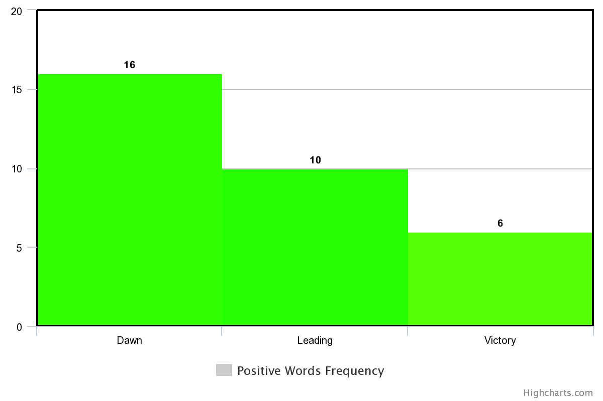
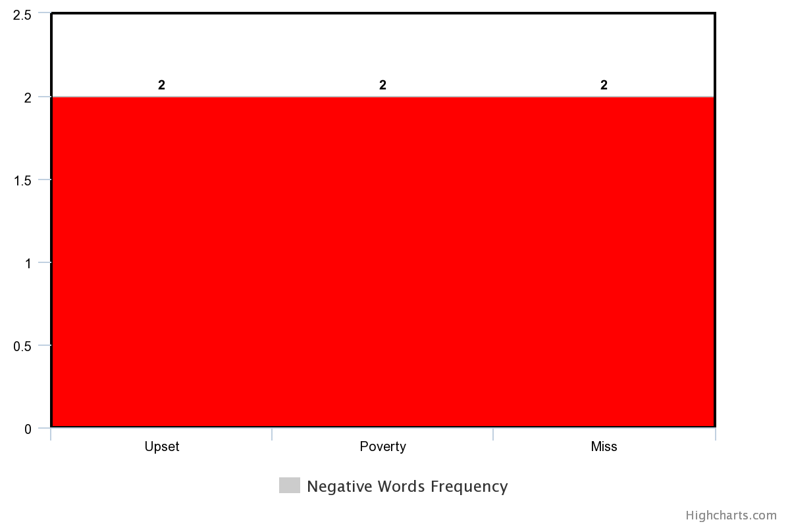
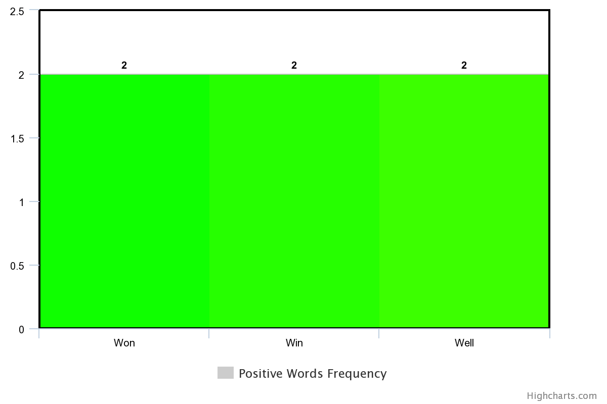

# Sentiment Analysis and Classification Of Pakistan's General Elections 2018

This script scrapes <b>100+</b> tweets regarding Pakistan's Election 2018 from [Twitter](https://twitter.com/search?q=%23PakistanElections2018&src=typd) and performs Sentiment Analysis.

Following are the steps we took to take this project to reality:
  - Generated dataset by scraping Twitter data using Selenium WebDriver
  - Preprocessed the tweets by cleansing them and removing extraneous information for our sentiment analysis model 
  - Used Bag of Words algorithm to count the frequency of words people used while presenting their opinion in tweets.
  - Used Classifier to see the dominant opinion of the audience regarding the results of elections.


```python
# enable intellisense in jupyter notebook
%config IPCompleter.greedy=True
```


```python
from selenium import webdriver
from parsel import Selector
from textblob import TextBlob
import collections
import nltk
import re
from nltk.tokenize import WordPunctTokenizer,word_tokenize
from nltk.stem import PorterStemmer
ps = PorterStemmer()
#total tweets
total_tweets=[]
```

# Scraping Tweets from Twitter


```python
try:
    driver = webdriver.Chrome()


    # search the twitter with hashtag (#PakistanElections2018)
    driver.get("https://twitter.com/search?q=%23PakistanElections2018&src=typd")


    # parse the page html through parser
    sel = Selector(driver.page_source)


    # scroll to end of page multiple times to load more tweets
    for i in range(30):
        from selenium.webdriver.common.keys import Keys
        import time
        htmlElement = driver.find_element_by_tag_name("html")
        htmlElement.send_keys(Keys.END)
        time.sleep(3)
except Exception as e:
    print(e)
```


```python
# extract the <p> tags containing tweets
sel = Selector(driver.page_source)
elems=sel.xpath("//*[@class='TweetTextSize  js-tweet-text tweet-text']").extract()
```

# Cleansing Tweets ( Preprocessing )

<b>Tokenizing and Stemming</b>


```python
counter = 1
pmln_counter=0
pti_counter=0
pmln_word_list = ["nawaz","shahbaz","sharif","pmln","maryam","nawaz sharif","shahbaz sharif"]
pti_word_list = ["imran khan","pti","captain","tehreek","insaaf","insaf"]
pti_tweets = []
pmln_tweets = []
for tweetContainerElement in elems:
    stemmed_words = []
    sel2 = Selector(tweetContainerElement)
    arrayOfTextInTweetParagraph=sel2.xpath(".//text()").extract()
    seperator=' '
    mergedTweet = seperator.join(arrayOfTextInTweetParagraph)
    mergedTweet = mergedTweet.lower()
    
    #clean the tweet
    mergedTweet = re.sub(r'@[A-Za-z0-9]+','',mergedTweet)
    mergedTweet = re.sub('https?://[A-Za-z0-9./]+','',mergedTweet)
    mergedTweet = re.sub("[^a-zA-Z]", " ", mergedTweet)
    mergedTweet = re.sub('((www\.[^\s]+)|(https?://[^\s]+))','',mergedTweet)
    mergedTweet = re.sub('([0-9]+)','', mergedTweet)
    mergedTweet = re.sub('@[^\s]+','',mergedTweet)
    mergedTweet = re.sub('[\s]+', ' ', mergedTweet)
    mergedTweet = re.sub('&amp;', '', mergedTweet)
    mergedTweet = re.sub(r'#([^\s]+)', r'\1', mergedTweet)
    mergedTweet = mergedTweet.strip('\'"')
    mergedTweet = mergedTweet.replace("#","")
    mergedTweet.replace(u"\ufffd", "?")
    words = word_tokenize(mergedTweet)
    #for word in words:
    #    stemmed_words.append(ps.stem(word))
    final_cleansed_tweet = (" ".join(words)).strip()
    print(str(counter)+" Tweets written successfully")
    counter = counter + 1
    for pmln_wd in pmln_word_list:
        if ((any(pmln_wd in wd for wd in final_cleansed_tweet.split())) and not (any("pti" in wd for wd in final_cleansed_tweet.split()))):
            pmln_counter=pmln_counter+1
            print(str(pmln_counter)+":PMLN TWEETS")
            pmln_tweets.append(final_cleansed_tweet)
            break
    for pti_wd in pti_word_list:
        if ((any("pti" in wd for wd in final_cleansed_tweet.split())) and not (any("pmln" in wd for wd in final_cleansed_tweet.split()))):
            pti_counter=pti_counter+1
            print(str(pti_counter)+":PTI TWEETS")
            pti_tweets.append(final_cleansed_tweet)
            break
    total_tweets.append(final_cleansed_tweet)
    total_tweets = list(set(total_tweets))
```

    1 Tweets written successfully
    2 Tweets written successfully
    1:PTI TWEETS
    3 Tweets written successfully
    4 Tweets written successfully
    5 Tweets written successfully
    6 Tweets written successfully
    7 Tweets written successfully
    8 Tweets written successfully
    9 Tweets written successfully
    2:PTI TWEETS
    10 Tweets written successfully
    11 Tweets written successfully
    12 Tweets written successfully
    13 Tweets written successfully
    14 Tweets written successfully
    1:PMLN TWEETS
    15 Tweets written successfully
    16 Tweets written successfully
    17 Tweets written successfully
    18 Tweets written successfully
    3:PTI TWEETS
    19 Tweets written successfully
    20 Tweets written successfully
    21 Tweets written successfully
    22 Tweets written successfully
    23 Tweets written successfully
    4:PTI TWEETS
    24 Tweets written successfully
    25 Tweets written successfully
    26 Tweets written successfully
    5:PTI TWEETS
    27 Tweets written successfully
    28 Tweets written successfully
    29 Tweets written successfully
    30 Tweets written successfully
    31 Tweets written successfully
    32 Tweets written successfully
    33 Tweets written successfully
    34 Tweets written successfully
    35 Tweets written successfully
    6:PTI TWEETS
    36 Tweets written successfully
    7:PTI TWEETS
    37 Tweets written successfully
    8:PTI TWEETS
    38 Tweets written successfully
    9:PTI TWEETS
    39 Tweets written successfully
    40 Tweets written successfully
    41 Tweets written successfully
    42 Tweets written successfully
    43 Tweets written successfully
    10:PTI TWEETS
    44 Tweets written successfully
    45 Tweets written successfully
    46 Tweets written successfully
    2:PMLN TWEETS
    47 Tweets written successfully
    48 Tweets written successfully
    49 Tweets written successfully
    50 Tweets written successfully
    51 Tweets written successfully
    52 Tweets written successfully
    11:PTI TWEETS
    53 Tweets written successfully
    54 Tweets written successfully
    55 Tweets written successfully
    56 Tweets written successfully
    57 Tweets written successfully
    58 Tweets written successfully
    59 Tweets written successfully
    60 Tweets written successfully
    12:PTI TWEETS
    61 Tweets written successfully
    62 Tweets written successfully
    63 Tweets written successfully
    64 Tweets written successfully
    65 Tweets written successfully
    66 Tweets written successfully
    3:PMLN TWEETS
    67 Tweets written successfully
    68 Tweets written successfully
    69 Tweets written successfully
    70 Tweets written successfully
    13:PTI TWEETS
    71 Tweets written successfully
    72 Tweets written successfully
    73 Tweets written successfully
    14:PTI TWEETS
    74 Tweets written successfully
    4:PMLN TWEETS
    75 Tweets written successfully
    76 Tweets written successfully
    77 Tweets written successfully
    15:PTI TWEETS
    78 Tweets written successfully
    79 Tweets written successfully
    80 Tweets written successfully
    81 Tweets written successfully
    82 Tweets written successfully
    16:PTI TWEETS
    83 Tweets written successfully
    84 Tweets written successfully
    17:PTI TWEETS
    85 Tweets written successfully
    86 Tweets written successfully
    18:PTI TWEETS
    87 Tweets written successfully
    88 Tweets written successfully
    89 Tweets written successfully
    90 Tweets written successfully
    5:PMLN TWEETS
    91 Tweets written successfully
    19:PTI TWEETS
    92 Tweets written successfully
    93 Tweets written successfully
    94 Tweets written successfully
    20:PTI TWEETS
    95 Tweets written successfully
    21:PTI TWEETS
    96 Tweets written successfully
    97 Tweets written successfully
    22:PTI TWEETS
    98 Tweets written successfully
    99 Tweets written successfully
    23:PTI TWEETS
    100 Tweets written successfully
    24:PTI TWEETS
    101 Tweets written successfully
    102 Tweets written successfully
    103 Tweets written successfully
    104 Tweets written successfully
    105 Tweets written successfully
    106 Tweets written successfully
    25:PTI TWEETS
    107 Tweets written successfully
    108 Tweets written successfully
    109 Tweets written successfully
    110 Tweets written successfully
    111 Tweets written successfully
    112 Tweets written successfully
    113 Tweets written successfully
    114 Tweets written successfully
    26:PTI TWEETS
    115 Tweets written successfully
    116 Tweets written successfully
    27:PTI TWEETS
    117 Tweets written successfully
    28:PTI TWEETS
    118 Tweets written successfully
    119 Tweets written successfully
    120 Tweets written successfully
    29:PTI TWEETS
    121 Tweets written successfully
    122 Tweets written successfully
    123 Tweets written successfully
    124 Tweets written successfully
    125 Tweets written successfully
    30:PTI TWEETS
    126 Tweets written successfully
    127 Tweets written successfully
    128 Tweets written successfully
    129 Tweets written successfully
    130 Tweets written successfully
    131 Tweets written successfully
    31:PTI TWEETS
    132 Tweets written successfully
    133 Tweets written successfully
    134 Tweets written successfully
    135 Tweets written successfully
    136 Tweets written successfully
    32:PTI TWEETS
    137 Tweets written successfully
    138 Tweets written successfully
    139 Tweets written successfully
    140 Tweets written successfully
    141 Tweets written successfully
    142 Tweets written successfully
    143 Tweets written successfully
    33:PTI TWEETS
    144 Tweets written successfully
    34:PTI TWEETS
    145 Tweets written successfully
    146 Tweets written successfully
    147 Tweets written successfully
    35:PTI TWEETS
    148 Tweets written successfully
    149 Tweets written successfully
    150 Tweets written successfully
    36:PTI TWEETS
    151 Tweets written successfully
    152 Tweets written successfully
    153 Tweets written successfully
    37:PTI TWEETS
    154 Tweets written successfully
    155 Tweets written successfully
    156 Tweets written successfully
    38:PTI TWEETS
    157 Tweets written successfully
    158 Tweets written successfully
    39:PTI TWEETS
    159 Tweets written successfully
    160 Tweets written successfully
    40:PTI TWEETS
    161 Tweets written successfully
    162 Tweets written successfully
    163 Tweets written successfully
    164 Tweets written successfully
    165 Tweets written successfully
    166 Tweets written successfully
    167 Tweets written successfully
    168 Tweets written successfully
    169 Tweets written successfully
    41:PTI TWEETS
    170 Tweets written successfully
    171 Tweets written successfully
    172 Tweets written successfully
    42:PTI TWEETS
    173 Tweets written successfully
    43:PTI TWEETS
    174 Tweets written successfully
    44:PTI TWEETS
    175 Tweets written successfully
    6:PMLN TWEETS
    176 Tweets written successfully
    177 Tweets written successfully
    45:PTI TWEETS
    178 Tweets written successfully
    179 Tweets written successfully
    180 Tweets written successfully
    181 Tweets written successfully
    182 Tweets written successfully
    183 Tweets written successfully
    46:PTI TWEETS
    184 Tweets written successfully
    47:PTI TWEETS
    185 Tweets written successfully
    186 Tweets written successfully
    187 Tweets written successfully
    188 Tweets written successfully
    189 Tweets written successfully
    190 Tweets written successfully
    48:PTI TWEETS
    191 Tweets written successfully
    192 Tweets written successfully
    193 Tweets written successfully
    194 Tweets written successfully
    49:PTI TWEETS
    195 Tweets written successfully
    50:PTI TWEETS
    196 Tweets written successfully
    51:PTI TWEETS
    197 Tweets written successfully
    198 Tweets written successfully
    52:PTI TWEETS
    199 Tweets written successfully
    200 Tweets written successfully
    53:PTI TWEETS
    201 Tweets written successfully
    54:PTI TWEETS
    202 Tweets written successfully
    203 Tweets written successfully
    7:PMLN TWEETS
    204 Tweets written successfully
    55:PTI TWEETS
    205 Tweets written successfully
    206 Tweets written successfully
    56:PTI TWEETS
    207 Tweets written successfully
    208 Tweets written successfully
    209 Tweets written successfully
    210 Tweets written successfully
    211 Tweets written successfully
    57:PTI TWEETS
    212 Tweets written successfully
    58:PTI TWEETS
    213 Tweets written successfully
    214 Tweets written successfully
    215 Tweets written successfully
    59:PTI TWEETS
    216 Tweets written successfully
    8:PMLN TWEETS
    217 Tweets written successfully
    60:PTI TWEETS
    218 Tweets written successfully
    219 Tweets written successfully
    220 Tweets written successfully
    221 Tweets written successfully
    9:PMLN TWEETS
    222 Tweets written successfully
    10:PMLN TWEETS
    223 Tweets written successfully
    224 Tweets written successfully
    11:PMLN TWEETS
    225 Tweets written successfully
    226 Tweets written successfully
    61:PTI TWEETS
    227 Tweets written successfully
    62:PTI TWEETS
    228 Tweets written successfully
    12:PMLN TWEETS
    229 Tweets written successfully
    13:PMLN TWEETS
    230 Tweets written successfully
    231 Tweets written successfully
    232 Tweets written successfully
    233 Tweets written successfully
    234 Tweets written successfully
    235 Tweets written successfully
    236 Tweets written successfully
    63:PTI TWEETS
    237 Tweets written successfully
    238 Tweets written successfully
    239 Tweets written successfully
    240 Tweets written successfully
    241 Tweets written successfully
    242 Tweets written successfully
    243 Tweets written successfully
    244 Tweets written successfully
    64:PTI TWEETS
    245 Tweets written successfully
    65:PTI TWEETS
    246 Tweets written successfully
    247 Tweets written successfully
    248 Tweets written successfully
    249 Tweets written successfully
    250 Tweets written successfully
    66:PTI TWEETS
    251 Tweets written successfully
    252 Tweets written successfully
    253 Tweets written successfully
    67:PTI TWEETS
    254 Tweets written successfully
    255 Tweets written successfully
    68:PTI TWEETS
    256 Tweets written successfully
    257 Tweets written successfully
    258 Tweets written successfully
    259 Tweets written successfully
    260 Tweets written successfully
    261 Tweets written successfully
    69:PTI TWEETS
    262 Tweets written successfully
    263 Tweets written successfully
    70:PTI TWEETS
    264 Tweets written successfully
    71:PTI TWEETS
    265 Tweets written successfully
    72:PTI TWEETS
    266 Tweets written successfully
    267 Tweets written successfully
    268 Tweets written successfully
    73:PTI TWEETS
    269 Tweets written successfully
    270 Tweets written successfully
    74:PTI TWEETS
    271 Tweets written successfully
    272 Tweets written successfully
    273 Tweets written successfully
    274 Tweets written successfully
    275 Tweets written successfully
    276 Tweets written successfully
    75:PTI TWEETS
    277 Tweets written successfully
    278 Tweets written successfully
    76:PTI TWEETS
    279 Tweets written successfully
    280 Tweets written successfully
    281 Tweets written successfully
    77:PTI TWEETS
    282 Tweets written successfully
    283 Tweets written successfully
    284 Tweets written successfully
    285 Tweets written successfully
    286 Tweets written successfully
    78:PTI TWEETS
    287 Tweets written successfully
    288 Tweets written successfully
    14:PMLN TWEETS
    289 Tweets written successfully
    290 Tweets written successfully
    291 Tweets written successfully
    292 Tweets written successfully
    293 Tweets written successfully
    294 Tweets written successfully
    295 Tweets written successfully
    79:PTI TWEETS
    296 Tweets written successfully
    297 Tweets written successfully
    298 Tweets written successfully
    299 Tweets written successfully
    80:PTI TWEETS
    300 Tweets written successfully
    301 Tweets written successfully
    302 Tweets written successfully
    303 Tweets written successfully
    304 Tweets written successfully
    305 Tweets written successfully
    306 Tweets written successfully
    307 Tweets written successfully
    308 Tweets written successfully
    81:PTI TWEETS
    309 Tweets written successfully
    15:PMLN TWEETS
    310 Tweets written successfully
    311 Tweets written successfully
    312 Tweets written successfully
    313 Tweets written successfully
    314 Tweets written successfully
    315 Tweets written successfully
    316 Tweets written successfully
    317 Tweets written successfully
    318 Tweets written successfully
    319 Tweets written successfully
    320 Tweets written successfully
    321 Tweets written successfully
    322 Tweets written successfully
    82:PTI TWEETS
    323 Tweets written successfully
    324 Tweets written successfully
    325 Tweets written successfully
    16:PMLN TWEETS
    326 Tweets written successfully
    327 Tweets written successfully
    328 Tweets written successfully
    329 Tweets written successfully
    83:PTI TWEETS
    330 Tweets written successfully
    331 Tweets written successfully
    84:PTI TWEETS
    332 Tweets written successfully
    333 Tweets written successfully
    334 Tweets written successfully
    335 Tweets written successfully
    336 Tweets written successfully
    337 Tweets written successfully
    338 Tweets written successfully
    339 Tweets written successfully
    340 Tweets written successfully
    341 Tweets written successfully
    342 Tweets written successfully
    343 Tweets written successfully
    344 Tweets written successfully
    345 Tweets written successfully
    346 Tweets written successfully
    347 Tweets written successfully
    348 Tweets written successfully
    349 Tweets written successfully
    350 Tweets written successfully
    351 Tweets written successfully
    352 Tweets written successfully
    17:PMLN TWEETS
    353 Tweets written successfully
    18:PMLN TWEETS
    354 Tweets written successfully
    355 Tweets written successfully
    356 Tweets written successfully
    357 Tweets written successfully
    358 Tweets written successfully
    359 Tweets written successfully
    85:PTI TWEETS
    360 Tweets written successfully
    361 Tweets written successfully
    362 Tweets written successfully
    363 Tweets written successfully
    364 Tweets written successfully
    365 Tweets written successfully
    366 Tweets written successfully
    367 Tweets written successfully
    368 Tweets written successfully
    369 Tweets written successfully
    19:PMLN TWEETS
    370 Tweets written successfully
    371 Tweets written successfully
    372 Tweets written successfully
    86:PTI TWEETS
    373 Tweets written successfully
    374 Tweets written successfully
    87:PTI TWEETS
    375 Tweets written successfully
    376 Tweets written successfully
    377 Tweets written successfully
    378 Tweets written successfully
    379 Tweets written successfully
    88:PTI TWEETS
    380 Tweets written successfully
    381 Tweets written successfully
    382 Tweets written successfully
    89:PTI TWEETS
    383 Tweets written successfully
    384 Tweets written successfully
    385 Tweets written successfully
    90:PTI TWEETS
    386 Tweets written successfully
    387 Tweets written successfully
    388 Tweets written successfully
    20:PMLN TWEETS
    389 Tweets written successfully
    390 Tweets written successfully
    391 Tweets written successfully
    392 Tweets written successfully
    393 Tweets written successfully
    91:PTI TWEETS
    394 Tweets written successfully
    395 Tweets written successfully
    396 Tweets written successfully
    397 Tweets written successfully
    398 Tweets written successfully
    399 Tweets written successfully
    400 Tweets written successfully
    401 Tweets written successfully
    21:PMLN TWEETS
    402 Tweets written successfully
    403 Tweets written successfully
    404 Tweets written successfully
    405 Tweets written successfully
    406 Tweets written successfully
    22:PMLN TWEETS
    407 Tweets written successfully
    408 Tweets written successfully
    409 Tweets written successfully
    410 Tweets written successfully
    92:PTI TWEETS
    411 Tweets written successfully
    23:PMLN TWEETS
    412 Tweets written successfully
    93:PTI TWEETS
    413 Tweets written successfully
    414 Tweets written successfully
    415 Tweets written successfully
    416 Tweets written successfully
    417 Tweets written successfully
    418 Tweets written successfully
    419 Tweets written successfully
    420 Tweets written successfully
    421 Tweets written successfully
    422 Tweets written successfully
    94:PTI TWEETS
    423 Tweets written successfully
    424 Tweets written successfully
    95:PTI TWEETS
    425 Tweets written successfully
    426 Tweets written successfully
    427 Tweets written successfully
    96:PTI TWEETS
    428 Tweets written successfully
    429 Tweets written successfully
    430 Tweets written successfully
    24:PMLN TWEETS
    431 Tweets written successfully
    432 Tweets written successfully
    433 Tweets written successfully
    97:PTI TWEETS
    434 Tweets written successfully
    435 Tweets written successfully
    436 Tweets written successfully
    437 Tweets written successfully
    438 Tweets written successfully
    439 Tweets written successfully
    440 Tweets written successfully
    25:PMLN TWEETS
    441 Tweets written successfully
    98:PTI TWEETS
    442 Tweets written successfully
    443 Tweets written successfully
    444 Tweets written successfully
    445 Tweets written successfully
    446 Tweets written successfully
    26:PMLN TWEETS
    447 Tweets written successfully
    448 Tweets written successfully
    449 Tweets written successfully
    450 Tweets written successfully
    451 Tweets written successfully
    452 Tweets written successfully
    453 Tweets written successfully
    27:PMLN TWEETS
    454 Tweets written successfully
    455 Tweets written successfully
    99:PTI TWEETS
    456 Tweets written successfully
    457 Tweets written successfully
    

# Writing Cleansed Tweets to a Text File


```python
try:
    with open("electionTweets.txt","w",encoding="utf-8") as textFile:
        for tweet in total_tweets:
            textFile.write(tweet+"\n")
        print("TOTAL TWEETS WRITTEN TO FILE SUCCESSFULLY")
except Exception as e:
    print(e)
try:
    with open("ptiElectionTweets.txt","w",encoding="utf-8") as textFile:
        for tweet in pti_tweets:
            textFile.write(tweet+"\n")
        print("PTI TWEETS WRITTEN TO FILE SUCCESSFULLY")
except Exception as e:
    print(e)
try:
    with open("pmlnElectionTweets.txt","w",encoding="utf-8") as textFile:
        for tweet in pmln_tweets:
            textFile.write(tweet+"\n")
        print("PMLN TWEETS WRITTEN TO FILE SUCCESSFULLY")
except Exception as e:
    print(e)
```

    TOTAL TWEETS WRITTEN TO FILE SUCCESSFULLY
    PTI TWEETS WRITTEN TO FILE SUCCESSFULLY
    PMLN TWEETS WRITTEN TO FILE SUCCESSFULLY
    


```python
try:
    driver.close()
    print("SELENIUM DRIVER CLOSED AFTER SCRAPING")
except Exception as e:
    print(e)
```

    SELENIUM DRIVER CLOSED AFTER SCRAPING
    

# Loading Dictionary Of Positive and Negative Words


```python
positive_words=[]
negative_words=[]
try:
    with open("positive-words.txt","r",encoding="utf-8") as textFile:
        positive_words = textFile.readlines()
    print("+ve words loaded")
except Exception as e:
    print(e)
try:
    with open("negative-words.txt","r",encoding="ISO-8859-1") as textFile2:
        negative_words = textFile2.readlines()
    print("-ve words loaded")
except Exception as e:
    print(e)
positive_words = [word.replace("\n","").replace("\ufeff","") for word in positive_words]
negative_words = [word.replace("\n","").replace("\ufeff","") for word in negative_words]
print(positive_words)
print("\n\n")
print(negative_words)
"""
Documents
"""
documents_positive = [(positive_words,"pos")]
documents_negative = [(negative_words,"neg")]
```

    +ve words loaded
    -ve words loaded
    ['a+', 'abound', 'abounds', 'abundance', 'abundant', 'accessable', 'accessible', 'acclaim', 'acclaimed', 'acclamation', 'accolade', 'accolades', 'accommodative', 'accomodative', 'accomplish', 'accomplished', 'accomplishment', 'accomplishments', 'accurate', 'accurately', 'achievable', 'achievement', 'achievements', 'achievible', 'acumen', 'adaptable', 'adaptive', 'adequate', 'adjustable', 'admirable', 'admirably', 'admiration', 'admire', 'admirer', 'admiring', 'admiringly', 'adorable', 'adore', 'adored', 'adorer', 'adoring', 'adoringly', 'adroit', 'adroitly', 'adulate', 'adulation', 'adulatory', 'advanced', 'advantage', 'advantageous', 'advantageously', 'advantages', 'adventuresome', 'adventurous', 'advocate', 'advocated', 'advocates', 'affability', 'affable', 'affably', 'affectation', 'affection', 'affectionate', 'affinity', 'affirm', 'affirmation', 'affirmative', 'affluence', 'affluent', 'afford', 'affordable', 'affordably', 'afordable', 'agile', 'agilely', 'agility', 'agreeable', 'agreeableness', 'agreeably', 'all-around', 'alluring', 'alluringly', 'altruistic', 'altruistically', 'amaze', 'amazed', 'amazement', 'amazes', 'amazing', 'amazingly', 'ambitious', 'ambitiously', 'ameliorate', 'amenable', 'amenity', 'amiability', 'amiabily', 'amiable', 'amicability', 'amicable', 'amicably', 'amity', 'ample', 'amply', 'amuse', 'amusing', 'amusingly', 'angel', 'angelic', 'apotheosis', 'appeal', 'appealing', 'applaud', 'appreciable', 'appreciate', 'appreciated', 'appreciates', 'appreciative', 'appreciatively', 'appropriate', 'approval', 'approve', 'ardent', 'ardently', 'ardor', 'articulate', 'aspiration', 'aspirations', 'aspire', 'assurance', 'assurances', 'assure', 'assuredly', 'assuring', 'astonish', 'astonished', 'astonishing', 'astonishingly', 'astonishment', 'astound', 'astounded', 'astounding', 'astoundingly', 'astutely', 'attentive', 'attraction', 'attractive', 'attractively', 'attune', 'audible', 'audibly', 'auspicious', 'authentic', 'authoritative', 'autonomous', 'available', 'aver', 'avid', 'avidly', 'award', 'awarded', 'awards', 'awe', 'awed', 'awesome', 'awesomely', 'awesomeness', 'awestruck', 'awsome', 'backbone', 'balanced', 'bargain', 'beauteous', 'beautiful', 'beautifullly', 'beautifully', 'beautify', 'beauty', 'beckon', 'beckoned', 'beckoning', 'beckons', 'believable', 'believeable', 'beloved', 'benefactor', 'beneficent', 'beneficial', 'beneficially', 'beneficiary', 'benefit', 'benefits', 'benevolence', 'benevolent', 'benifits', 'best', 'best-known', 'best-performing', 'best-selling', 'better', 'better-known', 'better-than-expected', 'beutifully', 'blameless', 'bless', 'blessing', 'bliss', 'blissful', 'blissfully', 'blithe', 'blockbuster', 'bloom', 'blossom', 'bolster', 'bonny', 'bonus', 'bonuses', 'boom', 'booming', 'boost', 'boundless', 'bountiful', 'brainiest', 'brainy', 'brand-new', 'brave', 'bravery', 'bravo', 'breakthrough', 'breakthroughs', 'breathlessness', 'breathtaking', 'breathtakingly', 'breeze', 'bright', 'brighten', 'brighter', 'brightest', 'brilliance', 'brilliances', 'brilliant', 'brilliantly', 'brisk', 'brotherly', 'bullish', 'buoyant', 'cajole', 'calm', 'calming', 'calmness', 'capability', 'capable', 'capably', 'captivate', 'captivating', 'carefree', 'cashback', 'cashbacks', 'catchy', 'celebrate', 'celebrated', 'celebration', 'celebratory', 'champ', 'champion', 'charisma', 'charismatic', 'charitable', 'charm', 'charming', 'charmingly', 'chaste', 'cheaper', 'cheapest', 'cheer', 'cheerful', 'cheery', 'cherish', 'cherished', 'cherub', 'chic', 'chivalrous', 'chivalry', 'civility', 'civilize', 'clarity', 'classic', 'classy', 'clean', 'cleaner', 'cleanest', 'cleanliness', 'cleanly', 'clear', 'clear-cut', 'cleared', 'clearer', 'clearly', 'clears', 'clever', 'cleverly', 'cohere', 'coherence', 'coherent', 'cohesive', 'colorful', 'comely', 'comfort', 'comfortable', 'comfortably', 'comforting', 'comfy', 'commend', 'commendable', 'commendably', 'commitment', 'commodious', 'compact', 'compactly', 'compassion', 'compassionate', 'compatible', 'competitive', 'complement', 'complementary', 'complemented', 'complements', 'compliant', 'compliment', 'complimentary', 'comprehensive', 'conciliate', 'conciliatory', 'concise', 'confidence', 'confident', 'congenial', 'congratulate', 'congratulation', 'congratulations', 'congratulatory', 'conscientious', 'considerate', 'consistent', 'consistently', 'constructive', 'consummate', 'contentment', 'continuity', 'contrasty', 'contribution', 'convenience', 'convenient', 'conveniently', 'convience', 'convienient', 'convient', 'convincing', 'convincingly', 'cool', 'coolest', 'cooperative', 'cooperatively', 'cornerstone', 'correct', 'correctly', 'cost-effective', 'cost-saving', 'counter-attack', 'counter-attacks', 'courage', 'courageous', 'courageously', 'courageousness', 'courteous', 'courtly', 'covenant', 'cozy', 'creative', 'credence', 'credible', 'crisp', 'crisper', 'cure', 'cure-all', 'cushy', 'cute', 'cuteness', 'danke', 'danken', 'daring', 'daringly', 'darling', 'dashing', 'dauntless', 'dawn', 'dazzle', 'dazzled', 'dazzling', 'dead-cheap', 'dead-on', 'decency', 'decent', 'decisive', 'decisiveness', 'dedicated', 'defeat', 'defeated', 'defeating', 'defeats', 'defender', 'deference', 'deft', 'deginified', 'delectable', 'delicacy', 'delicate', 'delicious', 'delight', 'delighted', 'delightful', 'delightfully', 'delightfulness', 'dependable', 'dependably', 'deservedly', 'deserving', 'desirable', 'desiring', 'desirous', 'destiny', 'detachable', 'devout', 'dexterous', 'dexterously', 'dextrous', 'dignified', 'dignify', 'dignity', 'diligence', 'diligent', 'diligently', 'diplomatic', 'dirt-cheap', 'distinction', 'distinctive', 'distinguished', 'diversified', 'divine', 'divinely', 'dominate', 'dominated', 'dominates', 'dote', 'dotingly', 'doubtless', 'dreamland', 'dumbfounded', 'dumbfounding', 'dummy-proof', 'durable', 'dynamic', 'eager', 'eagerly', 'eagerness', 'earnest', 'earnestly', 'earnestness', 'ease', 'eased', 'eases', 'easier', 'easiest', 'easiness', 'easing', 'easy', 'easy-to-use', 'easygoing', 'ebullience', 'ebullient', 'ebulliently', 'ecenomical', 'economical', 'ecstasies', 'ecstasy', 'ecstatic', 'ecstatically', 'edify', 'educated', 'effective', 'effectively', 'effectiveness', 'effectual', 'efficacious', 'efficient', 'efficiently', 'effortless', 'effortlessly', 'effusion', 'effusive', 'effusively', 'effusiveness', 'elan', 'elate', 'elated', 'elatedly', 'elation', 'electrify', 'elegance', 'elegant', 'elegantly', 'elevate', 'elite', 'eloquence', 'eloquent', 'eloquently', 'embolden', 'eminence', 'eminent', 'empathize', 'empathy', 'empower', 'empowerment', 'enchant', 'enchanted', 'enchanting', 'enchantingly', 'encourage', 'encouragement', 'encouraging', 'encouragingly', 'endear', 'endearing', 'endorse', 'endorsed', 'endorsement', 'endorses', 'endorsing', 'energetic', 'energize', 'energy-efficient', 'energy-saving', 'engaging', 'engrossing', 'enhance', 'enhanced', 'enhancement', 'enhances', 'enjoy', 'enjoyable', 'enjoyably', 'enjoyed', 'enjoying', 'enjoyment', 'enjoys', 'enlighten', 'enlightenment', 'enliven', 'ennoble', 'enough', 'enrapt', 'enrapture', 'enraptured', 'enrich', 'enrichment', 'enterprising', 'entertain', 'entertaining', 'entertains', 'enthral', 'enthrall', 'enthralled', 'enthuse', 'enthusiasm', 'enthusiast', 'enthusiastic', 'enthusiastically', 'entice', 'enticed', 'enticing', 'enticingly', 'entranced', 'entrancing', 'entrust', 'enviable', 'enviably', 'envious', 'enviously', 'enviousness', 'envy', 'equitable', 'ergonomical', 'err-free', 'erudite', 'ethical', 'eulogize', 'euphoria', 'euphoric', 'euphorically', 'evaluative', 'evenly', 'eventful', 'everlasting', 'evocative', 'exalt', 'exaltation', 'exalted', 'exaltedly', 'exalting', 'exaltingly', 'examplar', 'examplary', 'excallent', 'exceed', 'exceeded', 'exceeding', 'exceedingly', 'exceeds', 'excel', 'exceled', 'excelent', 'excellant', 'excelled', 'excellence', 'excellency', 'excellent', 'excellently', 'excels', 'exceptional', 'exceptionally', 'excite', 'excited', 'excitedly', 'excitedness', 'excitement', 'excites', 'exciting', 'excitingly', 'exellent', 'exemplar', 'exemplary', 'exhilarate', 'exhilarating', 'exhilaratingly', 'exhilaration', 'exonerate', 'expansive', 'expeditiously', 'expertly', 'exquisite', 'exquisitely', 'extol', 'extoll', 'extraordinarily', 'extraordinary', 'exuberance', 'exuberant', 'exuberantly', 'exult', 'exultant', 'exultation', 'exultingly', 'eye-catch', 'eye-catching', 'eyecatch', 'eyecatching', 'fabulous', 'fabulously', 'facilitate', 'fair', 'fairly', 'fairness', 'faith', 'faithful', 'faithfully', 'faithfulness', 'fame', 'famed', 'famous', 'famously', 'fancier', 'fancinating', 'fancy', 'fanfare', 'fans', 'fantastic', 'fantastically', 'fascinate', 'fascinating', 'fascinatingly', 'fascination', 'fashionable', 'fashionably', 'fast', 'fast-growing', 'fast-paced', 'faster', 'fastest', 'fastest-growing', 'faultless', 'fav', 'fave', 'favor', 'favorable', 'favored', 'favorite', 'favorited', 'favour', 'fearless', 'fearlessly', 'feasible', 'feasibly', 'feat', 'feature-rich', 'fecilitous', 'feisty', 'felicitate', 'felicitous', 'felicity', 'fertile', 'fervent', 'fervently', 'fervid', 'fervidly', 'fervor', 'festive', 'fidelity', 'fiery', 'fine', 'fine-looking', 'finely', 'finer', 'finest', 'firmer', 'first-class', 'first-in-class', 'first-rate', 'flashy', 'flatter', 'flattering', 'flatteringly', 'flawless', 'flawlessly', 'flexibility', 'flexible', 'flourish', 'flourishing', 'fluent', 'flutter', 'fond', 'fondly', 'fondness', 'foolproof', 'foremost', 'foresight', 'formidable', 'fortitude', 'fortuitous', 'fortuitously', 'fortunate', 'fortunately', 'fortune', 'fragrant', 'free', 'freed', 'freedom', 'freedoms', 'fresh', 'fresher', 'freshest', 'friendliness', 'friendly', 'frolic', 'frugal', 'fruitful', 'ftw', 'fulfillment', 'fun', 'futurestic', 'futuristic', 'gaiety', 'gaily', 'gain', 'gained', 'gainful', 'gainfully', 'gaining', 'gains', 'gallant', 'gallantly', 'galore', 'geekier', 'geeky', 'gem', 'gems', 'generosity', 'generous', 'generously', 'genial', 'genius', 'gentle', 'gentlest', 'genuine', 'gifted', 'glad', 'gladden', 'gladly', 'gladness', 'glamorous', 'glee', 'gleeful', 'gleefully', 'glimmer', 'glimmering', 'glisten', 'glistening', 'glitter', 'glitz', 'glorify', 'glorious', 'gloriously', 'glory', 'glow', 'glowing', 'glowingly', 'god-given', 'god-send', 'godlike', 'godsend', 'gold', 'golden', 'good', 'goodly', 'goodness', 'goodwill', 'goood', 'gooood', 'gorgeous', 'gorgeously', 'grace', 'graceful', 'gracefully', 'gracious', 'graciously', 'graciousness', 'grand', 'grandeur', 'grateful', 'gratefully', 'gratification', 'gratified', 'gratifies', 'gratify', 'gratifying', 'gratifyingly', 'gratitude', 'great', 'greatest', 'greatness', 'grin', 'groundbreaking', 'guarantee', 'guidance', 'guiltless', 'gumption', 'gush', 'gusto', 'gutsy', 'hail', 'halcyon', 'hale', 'hallmark', 'hallmarks', 'hallowed', 'handier', 'handily', 'hands-down', 'handsome', 'handsomely', 'handy', 'happier', 'happily', 'happiness', 'happy', 'hard-working', 'hardier', 'hardy', 'harmless', 'harmonious', 'harmoniously', 'harmonize', 'harmony', 'headway', 'heal', 'healthful', 'healthy', 'hearten', 'heartening', 'heartfelt', 'heartily', 'heartwarming', 'heaven', 'heavenly', 'helped', 'helpful', 'helping', 'hero', 'heroic', 'heroically', 'heroine', 'heroize', 'heros', 'high-quality', 'high-spirited', 'hilarious', 'holy', 'homage', 'honest', 'honesty', 'honor', 'honorable', 'honored', 'honoring', 'hooray', 'hopeful', 'hospitable', 'hot', 'hotcake', 'hotcakes', 'hottest', 'hug', 'humane', 'humble', 'humility', 'humor', 'humorous', 'humorously', 'humour', 'humourous', 'ideal', 'idealize', 'ideally', 'idol', 'idolize', 'idolized', 'idyllic', 'illuminate', 'illuminati', 'illuminating', 'illumine', 'illustrious', 'ilu', 'imaculate', 'imaginative', 'immaculate', 'immaculately', 'immense', 'impartial', 'impartiality', 'impartially', 'impassioned', 'impeccable', 'impeccably', 'important', 'impress', 'impressed', 'impresses', 'impressive', 'impressively', 'impressiveness', 'improve', 'improved', 'improvement', 'improvements', 'improves', 'improving', 'incredible', 'incredibly', 'indebted', 'individualized', 'indulgence', 'indulgent', 'industrious', 'inestimable', 'inestimably', 'inexpensive', 'infallibility', 'infallible', 'infallibly', 'influential', 'ingenious', 'ingeniously', 'ingenuity', 'ingenuous', 'ingenuously', 'innocuous', 'innovation', 'innovative', 'inpressed', 'insightful', 'insightfully', 'inspiration', 'inspirational', 'inspire', 'inspiring', 'instantly', 'instructive', 'instrumental', 'integral', 'integrated', 'intelligence', 'intelligent', 'intelligible', 'interesting', 'interests', 'intimacy', 'intimate', 'intricate', 'intrigue', 'intriguing', 'intriguingly', 'intuitive', 'invaluable', 'invaluablely', 'inventive', 'invigorate', 'invigorating', 'invincibility', 'invincible', 'inviolable', 'inviolate', 'invulnerable', 'irreplaceable', 'irreproachable', 'irresistible', 'irresistibly', 'issue-free', 'jaw-droping', 'jaw-dropping', 'jollify', 'jolly', 'jovial', 'joy', 'joyful', 'joyfully', 'joyous', 'joyously', 'jubilant', 'jubilantly', 'jubilate', 'jubilation', 'jubiliant', 'judicious', 'justly', 'keen', 'keenly', 'keenness', 'kid-friendly', 'kindliness', 'kindly', 'kindness', 'knowledgeable', 'kudos', 'large-capacity', 'laud', 'laudable', 'laudably', 'lavish', 'lavishly', 'law-abiding', 'lawful', 'lawfully', 'lead', 'leading', 'leads', 'lean', 'led', 'legendary', 'leverage', 'levity', 'liberate', 'liberation', 'liberty', 'lifesaver', 'light-hearted', 'lighter', 'likable', 'like', 'liked', 'likes', 'liking', 'lionhearted', 'lively', 'logical', 'long-lasting', 'lovable', 'lovably', 'love', 'loved', 'loveliness', 'lovely', 'lover', 'loves', 'loving', 'low-cost', 'low-price', 'low-priced', 'low-risk', 'lower-priced', 'loyal', 'loyalty', 'lucid', 'lucidly', 'luck', 'luckier', 'luckiest', 'luckiness', 'lucky', 'lucrative', 'luminous', 'lush', 'luster', 'lustrous', 'luxuriant', 'luxuriate', 'luxurious', 'luxuriously', 'luxury', 'lyrical', 'magic', 'magical', 'magnanimous', 'magnanimously', 'magnificence', 'magnificent', 'magnificently', 'majestic', 'majesty', 'manageable', 'maneuverable', 'marvel', 'marveled', 'marvelled', 'marvellous', 'marvelous', 'marvelously', 'marvelousness', 'marvels', 'master', 'masterful', 'masterfully', 'masterpiece', 'masterpieces', 'masters', 'mastery', 'matchless', 'mature', 'maturely', 'maturity', 'meaningful', 'memorable', 'merciful', 'mercifully', 'mercy', 'merit', 'meritorious', 'merrily', 'merriment', 'merriness', 'merry', 'mesmerize', 'mesmerized', 'mesmerizes', 'mesmerizing', 'mesmerizingly', 'meticulous', 'meticulously', 'mightily', 'mighty', 'mind-blowing', 'miracle', 'miracles', 'miraculous', 'miraculously', 'miraculousness', 'modern', 'modest', 'modesty', 'momentous', 'monumental', 'monumentally', 'morality', 'motivated', 'multi-purpose', 'navigable', 'neat', 'neatest', 'neatly', 'nice', 'nicely', 'nicer', 'nicest', 'nifty', 'nimble', 'noble', 'nobly', 'noiseless', 'non-violence', 'non-violent', 'notably', 'noteworthy', 'nourish', 'nourishing', 'nourishment', 'novelty', 'nurturing', 'oasis', 'obsession', 'obsessions', 'obtainable', 'openly', 'openness', 'optimal', 'optimism', 'optimistic', 'opulent', 'orderly', 'originality', 'outdo', 'outdone', 'outperform', 'outperformed', 'outperforming', 'outperforms', 'outshine', 'outshone', 'outsmart', 'outstanding', 'outstandingly', 'outstrip', 'outwit', 'ovation', 'overjoyed', 'overtake', 'overtaken', 'overtakes', 'overtaking', 'overtook', 'overture', 'pain-free', 'painless', 'painlessly', 'palatial', 'pamper', 'pampered', 'pamperedly', 'pamperedness', 'pampers', 'panoramic', 'paradise', 'paramount', 'pardon', 'passion', 'passionate', 'passionately', 'patience', 'patient', 'patiently', 'patriot', 'patriotic', 'peace', 'peaceable', 'peaceful', 'peacefully', 'peacekeepers', 'peach', 'peerless', 'pep', 'pepped', 'pepping', 'peppy', 'peps', 'perfect', 'perfection', 'perfectly', 'permissible', 'perseverance', 'persevere', 'personages', 'personalized', 'phenomenal', 'phenomenally', 'picturesque', 'piety', 'pinnacle', 'playful', 'playfully', 'pleasant', 'pleasantly', 'pleased', 'pleases', 'pleasing', 'pleasingly', 'pleasurable', 'pleasurably', 'pleasure', 'plentiful', 'pluses', 'plush', 'plusses', 'poetic', 'poeticize', 'poignant', 'poise', 'poised', 'polished', 'polite', 'politeness', 'popular', 'portable', 'posh', 'positive', 'positively', 'positives', 'powerful', 'powerfully', 'praise', 'praiseworthy', 'praising', 'pre-eminent', 'precious', 'precise', 'precisely', 'preeminent', 'prefer', 'preferable', 'preferably', 'prefered', 'preferes', 'preferring', 'prefers', 'premier', 'prestige', 'prestigious', 'prettily', 'pretty', 'priceless', 'pride', 'principled', 'privilege', 'privileged', 'prize', 'proactive', 'problem-free', 'problem-solver', 'prodigious', 'prodigiously', 'prodigy', 'productive', 'productively', 'proficient', 'proficiently', 'profound', 'profoundly', 'profuse', 'profusion', 'progress', 'progressive', 'prolific', 'prominence', 'prominent', 'promise', 'promised', 'promises', 'promising', 'promoter', 'prompt', 'promptly', 'proper', 'properly', 'propitious', 'propitiously', 'pros', 'prosper', 'prosperity', 'prosperous', 'prospros', 'protect', 'protection', 'protective', 'proud', 'proven', 'proves', 'providence', 'proving', 'prowess', 'prudence', 'prudent', 'prudently', 'punctual', 'pure', 'purify', 'purposeful', 'quaint', 'qualified', 'qualify', 'quicker', 'quiet', 'quieter', 'radiance', 'radiant', 'rapid', 'rapport', 'rapt', 'rapture', 'raptureous', 'raptureously', 'rapturous', 'rapturously', 'rational', 'razor-sharp', 'reachable', 'readable', 'readily', 'ready', 'reaffirm', 'reaffirmation', 'realistic', 'realizable', 'reasonable', 'reasonably', 'reasoned', 'reassurance', 'reassure', 'receptive', 'reclaim', 'recomend', 'recommend', 'recommendation', 'recommendations', 'recommended', 'reconcile', 'reconciliation', 'record-setting', 'recover', 'recovery', 'rectification', 'rectify', 'rectifying', 'redeem', 'redeeming', 'redemption', 'refine', 'refined', 'refinement', 'reform', 'reformed', 'reforming', 'reforms', 'refresh', 'refreshed', 'refreshing', 'refund', 'refunded', 'regal', 'regally', 'regard', 'rejoice', 'rejoicing', 'rejoicingly', 'rejuvenate', 'rejuvenated', 'rejuvenating', 'relaxed', 'relent', 'reliable', 'reliably', 'relief', 'relish', 'remarkable', 'remarkably', 'remedy', 'remission', 'remunerate', 'renaissance', 'renewed', 'renown', 'renowned', 'replaceable', 'reputable', 'reputation', 'resilient', 'resolute', 'resound', 'resounding', 'resourceful', 'resourcefulness', 'respect', 'respectable', 'respectful', 'respectfully', 'respite', 'resplendent', 'responsibly', 'responsive', 'restful', 'restored', 'restructure', 'restructured', 'restructuring', 'retractable', 'revel', 'revelation', 'revere', 'reverence', 'reverent', 'reverently', 'revitalize', 'revival', 'revive', 'revives', 'revolutionary', 'revolutionize', 'revolutionized', 'revolutionizes', 'reward', 'rewarding', 'rewardingly', 'rich', 'richer', 'richly', 'richness', 'right', 'righten', 'righteous', 'righteously', 'righteousness', 'rightful', 'rightfully', 'rightly', 'rightness', 'risk-free', 'robust', 'rock-star', 'rock-stars', 'rockstar', 'rockstars', 'romantic', 'romantically', 'romanticize', 'roomier', 'roomy', 'rosy', 'safe', 'safely', 'sagacity', 'sagely', 'saint', 'saintliness', 'saintly', 'salutary', 'salute', 'sane', 'satisfactorily', 'satisfactory', 'satisfied', 'satisfies', 'satisfy', 'satisfying', 'satisified', 'saver', 'savings', 'savior', 'savvy', 'scenic', 'seamless', 'seasoned', 'secure', 'securely', 'selective', 'self-determination', 'self-respect', 'self-satisfaction', 'self-sufficiency', 'self-sufficient', 'sensation', 'sensational', 'sensationally', 'sensations', 'sensible', 'sensibly', 'sensitive', 'serene', 'serenity', 'sexy', 'sharp', 'sharper', 'sharpest', 'shimmering', 'shimmeringly', 'shine', 'shiny', 'significant', 'silent', 'simpler', 'simplest', 'simplified', 'simplifies', 'simplify', 'simplifying', 'sincere', 'sincerely', 'sincerity', 'skill', 'skilled', 'skillful', 'skillfully', 'slammin', 'sleek', 'slick', 'smart', 'smarter', 'smartest', 'smartly', 'smile', 'smiles', 'smiling', 'smilingly', 'smitten', 'smooth', 'smoother', 'smoothes', 'smoothest', 'smoothly', 'snappy', 'snazzy', 'sociable', 'soft', 'softer', 'solace', 'solicitous', 'solicitously', 'solid', 'solidarity', 'soothe', 'soothingly', 'sophisticated', 'soulful', 'soundly', 'soundness', 'spacious', 'sparkle', 'sparkling', 'spectacular', 'spectacularly', 'speedily', 'speedy', 'spellbind', 'spellbinding', 'spellbindingly', 'spellbound', 'spirited', 'spiritual', 'splendid', 'splendidly', 'splendor', 'spontaneous', 'sporty', 'spotless', 'sprightly', 'stability', 'stabilize', 'stable', 'stainless', 'standout', 'state-of-the-art', 'stately', 'statuesque', 'staunch', 'staunchly', 'staunchness', 'steadfast', 'steadfastly', 'steadfastness', 'steadiest', 'steadiness', 'steady', 'stellar', 'stellarly', 'stimulate', 'stimulates', 'stimulating', 'stimulative', 'stirringly', 'straighten', 'straightforward', 'streamlined', 'striking', 'strikingly', 'striving', 'strong', 'stronger', 'strongest', 'stunned', 'stunning', 'stunningly', 'stupendous', 'stupendously', 'sturdier', 'sturdy', 'stylish', 'stylishly', 'stylized', 'suave', 'suavely', 'sublime', 'subsidize', 'subsidized', 'subsidizes', 'subsidizing', 'substantive', 'succeed', 'succeeded', 'succeeding', 'succeeds', 'succes', 'success', 'successes', 'successful', 'successfully', 'suffice', 'sufficed', 'suffices', 'sufficient', 'sufficiently', 'suitable', 'sumptuous', 'sumptuously', 'sumptuousness', 'super', 'superb', 'superbly', 'superior', 'superiority', 'supple', 'support', 'supported', 'supporter', 'supporting', 'supportive', 'supports', 'supremacy', 'supreme', 'supremely', 'supurb', 'supurbly', 'surmount', 'surpass', 'surreal', 'survival', 'survivor', 'sustainability', 'sustainable', 'swank', 'swankier', 'swankiest', 'swanky', 'sweeping', 'sweet', 'sweeten', 'sweetheart', 'sweetly', 'sweetness', 'swift', 'swiftness', 'talent', 'talented', 'talents', 'tantalize', 'tantalizing', 'tantalizingly', 'tempt', 'tempting', 'temptingly', 'tenacious', 'tenaciously', 'tenacity', 'tender', 'tenderly', 'terrific', 'terrifically', 'thank', 'thankful', 'thinner', 'thoughtful', 'thoughtfully', 'thoughtfulness', 'thrift', 'thrifty', 'thrill', 'thrilled', 'thrilling', 'thrillingly', 'thrills', 'thrive', 'thriving', 'thumb-up', 'thumbs-up', 'tickle', 'tidy', 'time-honored', 'timely', 'tingle', 'titillate', 'titillating', 'titillatingly', 'togetherness', 'tolerable', 'toll-free', 'top', 'top-notch', 'top-quality', 'topnotch', 'tops', 'tough', 'tougher', 'toughest', 'traction', 'tranquil', 'tranquility', 'transparent', 'treasure', 'tremendously', 'trendy', 'triumph', 'triumphal', 'triumphant', 'triumphantly', 'trivially', 'trophy', 'trouble-free', 'trump', 'trumpet', 'trust', 'trusted', 'trusting', 'trustingly', 'trustworthiness', 'trustworthy', 'trusty', 'truthful', 'truthfully', 'truthfulness', 'twinkly', 'ultra-crisp', 'unabashed', 'unabashedly', 'unaffected', 'unassailable', 'unbeatable', 'unbiased', 'unbound', 'uncomplicated', 'unconditional', 'undamaged', 'undaunted', 'understandable', 'undisputable', 'undisputably', 'undisputed', 'unencumbered', 'unequivocal', 'unequivocally', 'unfazed', 'unfettered', 'unforgettable', 'unity', 'unlimited', 'unmatched', 'unparalleled', 'unquestionable', 'unquestionably', 'unreal', 'unrestricted', 'unrivaled', 'unselfish', 'unwavering', 'upbeat', 'upgradable', 'upgradeable', 'upgraded', 'upheld', 'uphold', 'uplift', 'uplifting', 'upliftingly', 'upliftment', 'upscale', 'usable', 'useable', 'useful', 'user-friendly', 'user-replaceable', 'valiant', 'valiantly', 'valor', 'valuable', 'variety', 'venerate', 'verifiable', 'veritable', 'versatile', 'versatility', 'vibrant', 'vibrantly', 'victorious', 'victory', 'viewable', 'vigilance', 'vigilant', 'virtue', 'virtuous', 'virtuously', 'visionary', 'vivacious', 'vivid', 'vouch', 'vouchsafe', 'warm', 'warmer', 'warmhearted', 'warmly', 'warmth', 'wealthy', 'welcome', 'well', 'well-backlit', 'well-balanced', 'well-behaved', 'well-being', 'well-bred', 'well-connected', 'well-educated', 'well-established', 'well-informed', 'well-intentioned', 'well-known', 'well-made', 'well-managed', 'well-mannered', 'well-positioned', 'well-received', 'well-regarded', 'well-rounded', 'well-run', 'well-wishers', 'wellbeing', 'whoa', 'wholeheartedly', 'wholesome', 'whooa', 'whoooa', 'wieldy', 'willing', 'willingly', 'willingness', 'win', 'windfall', 'winnable', 'winner', 'winners', 'winning', 'wins', 'wisdom', 'wise', 'wisely', 'witty', 'won', 'wonder', 'wonderful', 'wonderfully', 'wonderous', 'wonderously', 'wonders', 'wondrous', 'woo', 'work', 'workable', 'worked', 'works', 'world-famous', 'worth', 'worth-while', 'worthiness', 'worthwhile', 'worthy', 'wow', 'wowed', 'wowing', 'wows', 'yay', 'youthful', 'zeal', 'zenith', 'zest', 'zippy']
    
    
    
    ['2-faced', '2-faces', 'abnormal', 'abolish', 'abominable', 'abominably', 'abominate', 'abomination', 'abort', 'aborted', 'aborts', 'abrade', 'abrasive', 'abrupt', 'abruptly', 'abscond', 'absence', 'absent-minded', 'absentee', 'absurd', 'absurdity', 'absurdly', 'absurdness', 'abuse', 'abused', 'abuses', 'abusive', 'abysmal', 'abysmally', 'abyss', 'accidental', 'accost', 'accursed', 'accusation', 'accusations', 'accuse', 'accuses', 'accusing', 'accusingly', 'acerbate', 'acerbic', 'acerbically', 'ache', 'ached', 'aches', 'achey', 'aching', 'acrid', 'acridly', 'acridness', 'acrimonious', 'acrimoniously', 'acrimony', 'adamant', 'adamantly', 'addict', 'addicted', 'addicting', 'addicts', 'admonish', 'admonisher', 'admonishingly', 'admonishment', 'admonition', 'adulterate', 'adulterated', 'adulteration', 'adulterier', 'adversarial', 'adversary', 'adverse', 'adversity', 'afflict', 'affliction', 'afflictive', 'affront', 'afraid', 'aggravate', 'aggravating', 'aggravation', 'aggression', 'aggressive', 'aggressiveness', 'aggressor', 'aggrieve', 'aggrieved', 'aggrivation', 'aghast', 'agonies', 'agonize', 'agonizing', 'agonizingly', 'agony', 'aground', 'ail', 'ailing', 'ailment', 'aimless', 'alarm', 'alarmed', 'alarming', 'alarmingly', 'alienate', 'alienated', 'alienation', 'allegation', 'allegations', 'allege', 'allergic', 'allergies', 'allergy', 'aloof', 'altercation', 'ambiguity', 'ambiguous', 'ambivalence', 'ambivalent', 'ambush', 'amiss', 'amputate', 'anarchism', 'anarchist', 'anarchistic', 'anarchy', 'anemic', 'anger', 'angrily', 'angriness', 'angry', 'anguish', 'animosity', 'annihilate', 'annihilation', 'annoy', 'annoyance', 'annoyances', 'annoyed', 'annoying', 'annoyingly', 'annoys', 'anomalous', 'anomaly', 'antagonism', 'antagonist', 'antagonistic', 'antagonize', 'anti-', 'anti-american', 'anti-israeli', 'anti-occupation', 'anti-proliferation', 'anti-semites', 'anti-social', 'anti-us', 'anti-white', 'antipathy', 'antiquated', 'antithetical', 'anxieties', 'anxiety', 'anxious', 'anxiously', 'anxiousness', 'apathetic', 'apathetically', 'apathy', 'apocalypse', 'apocalyptic', 'apologist', 'apologists', 'appal', 'appall', 'appalled', 'appalling', 'appallingly', 'apprehension', 'apprehensions', 'apprehensive', 'apprehensively', 'arbitrary', 'arcane', 'archaic', 'arduous', 'arduously', 'argumentative', 'arrogance', 'arrogant', 'arrogantly', 'ashamed', 'asinine', 'asininely', 'asinininity', 'askance', 'asperse', 'aspersion', 'aspersions', 'assail', 'assassin', 'assassinate', 'assault', 'assult', 'astray', 'asunder', 'atrocious', 'atrocities', 'atrocity', 'atrophy', 'attack', 'attacks', 'audacious', 'audaciously', 'audaciousness', 'audacity', 'audiciously', 'austere', 'authoritarian', 'autocrat', 'autocratic', 'avalanche', 'avarice', 'avaricious', 'avariciously', 'avenge', 'averse', 'aversion', 'aweful', 'awful', 'awfully', 'awfulness', 'awkward', 'awkwardness', 'ax', 'babble', 'back-logged', 'back-wood', 'back-woods', 'backache', 'backaches', 'backaching', 'backbite', 'backbiting', 'backward', 'backwardness', 'backwood', 'backwoods', 'bad', 'badly', 'baffle', 'baffled', 'bafflement', 'baffling', 'bait', 'balk', 'banal', 'banalize', 'bane', 'banish', 'banishment', 'bankrupt', 'barbarian', 'barbaric', 'barbarically', 'barbarity', 'barbarous', 'barbarously', 'barren', 'baseless', 'bash', 'bashed', 'bashful', 'bashing', 'bastard', 'bastards', 'battered', 'battering', 'batty', 'bearish', 'beastly', 'bedlam', 'bedlamite', 'befoul', 'beg', 'beggar', 'beggarly', 'begging', 'beguile', 'belabor', 'belated', 'beleaguer', 'belie', 'belittle', 'belittled', 'belittling', 'bellicose', 'belligerence', 'belligerent', 'belligerently', 'bemoan', 'bemoaning', 'bemused', 'bent', 'berate', 'bereave', 'bereavement', 'bereft', 'berserk', 'beseech', 'beset', 'besiege', 'besmirch', 'bestial', 'betray', 'betrayal', 'betrayals', 'betrayer', 'betraying', 'betrays', 'bewail', 'beware', 'bewilder', 'bewildered', 'bewildering', 'bewilderingly', 'bewilderment', 'bewitch', 'bias', 'biased', 'biases', 'bicker', 'bickering', 'bid-rigging', 'bigotries', 'bigotry', 'bitch', 'bitchy', 'biting', 'bitingly', 'bitter', 'bitterly', 'bitterness', 'bizarre', 'blab', 'blabber', 'blackmail', 'blah', 'blame', 'blameworthy', 'bland', 'blandish', 'blaspheme', 'blasphemous', 'blasphemy', 'blasted', 'blatant', 'blatantly', 'blather', 'bleak', 'bleakly', 'bleakness', 'bleed', 'bleeding', 'bleeds', 'blemish', 'blind', 'blinding', 'blindingly', 'blindside', 'blister', 'blistering', 'bloated', 'blockage', 'blockhead', 'bloodshed', 'bloodthirsty', 'bloody', 'blotchy', 'blow', 'blunder', 'blundering', 'blunders', 'blunt', 'blur', 'bluring', 'blurred', 'blurring', 'blurry', 'blurs', 'blurt', 'boastful', 'boggle', 'bogus', 'boil', 'boiling', 'boisterous', 'bomb', 'bombard', 'bombardment', 'bombastic', 'bondage', 'bonkers', 'bore', 'bored', 'boredom', 'bores', 'boring', 'botch', 'bother', 'bothered', 'bothering', 'bothers', 'bothersome', 'bowdlerize', 'boycott', 'braggart', 'bragger', 'brainless', 'brainwash', 'brash', 'brashly', 'brashness', 'brat', 'bravado', 'brazen', 'brazenly', 'brazenness', 'breach', 'break', 'break-up', 'break-ups', 'breakdown', 'breaking', 'breaks', 'breakup', 'breakups', 'bribery', 'brimstone', 'bristle', 'brittle', 'broke', 'broken', 'broken-hearted', 'brood', 'browbeat', 'bruise', 'bruised', 'bruises', 'bruising', 'brusque', 'brutal', 'brutalising', 'brutalities', 'brutality', 'brutalize', 'brutalizing', 'brutally', 'brute', 'brutish', 'bs', 'buckle', 'bug', 'bugging', 'buggy', 'bugs', 'bulkier', 'bulkiness', 'bulky', 'bulkyness', 'bull****', 'bull----', 'bullies', 'bullshit', 'bullshyt', 'bully', 'bullying', 'bullyingly', 'bum', 'bump', 'bumped', 'bumping', 'bumpping', 'bumps', 'bumpy', 'bungle', 'bungler', 'bungling', 'bunk', 'burden', 'burdensome', 'burdensomely', 'burn', 'burned', 'burning', 'burns', 'bust', 'busts', 'busybody', 'butcher', 'butchery', 'buzzing', 'byzantine', 'cackle', 'calamities', 'calamitous', 'calamitously', 'calamity', 'callous', 'calumniate', 'calumniation', 'calumnies', 'calumnious', 'calumniously', 'calumny', 'cancer', 'cancerous', 'cannibal', 'cannibalize', 'capitulate', 'capricious', 'capriciously', 'capriciousness', 'capsize', 'careless', 'carelessness', 'caricature', 'carnage', 'carp', 'cartoonish', 'cash-strapped', 'castigate', 'castrated', 'casualty', 'cataclysm', 'cataclysmal', 'cataclysmic', 'cataclysmically', 'catastrophe', 'catastrophes', 'catastrophic', 'catastrophically', 'catastrophies', 'caustic', 'caustically', 'cautionary', 'cave', 'censure', 'chafe', 'chaff', 'chagrin', 'challenging', 'chaos', 'chaotic', 'chasten', 'chastise', 'chastisement', 'chatter', 'chatterbox', 'cheap', 'cheapen', 'cheaply', 'cheat', 'cheated', 'cheater', 'cheating', 'cheats', 'checkered', 'cheerless', 'cheesy', 'chide', 'childish', 'chill', 'chilly', 'chintzy', 'choke', 'choleric', 'choppy', 'chore', 'chronic', 'chunky', 'clamor', 'clamorous', 'clash', 'cliche', 'cliched', 'clique', 'clog', 'clogged', 'clogs', 'cloud', 'clouding', 'cloudy', 'clueless', 'clumsy', 'clunky', 'coarse', 'cocky', 'coerce', 'coercion', 'coercive', 'cold', 'coldly', 'collapse', 'collude', 'collusion', 'combative', 'combust', 'comical', 'commiserate', 'commonplace', 'commotion', 'commotions', 'complacent', 'complain', 'complained', 'complaining', 'complains', 'complaint', 'complaints', 'complex', 'complicated', 'complication', 'complicit', 'compulsion', 'compulsive', 'concede', 'conceded', 'conceit', 'conceited', 'concen', 'concens', 'concern', 'concerned', 'concerns', 'concession', 'concessions', 'condemn', 'condemnable', 'condemnation', 'condemned', 'condemns', 'condescend', 'condescending', 'condescendingly', 'condescension', 'confess', 'confession', 'confessions', 'confined', 'conflict', 'conflicted', 'conflicting', 'conflicts', 'confound', 'confounded', 'confounding', 'confront', 'confrontation', 'confrontational', 'confuse', 'confused', 'confuses', 'confusing', 'confusion', 'confusions', 'congested', 'congestion', 'cons', 'conscons', 'conservative', 'conspicuous', 'conspicuously', 'conspiracies', 'conspiracy', 'conspirator', 'conspiratorial', 'conspire', 'consternation', 'contagious', 'contaminate', 'contaminated', 'contaminates', 'contaminating', 'contamination', 'contempt', 'contemptible', 'contemptuous', 'contemptuously', 'contend', 'contention', 'contentious', 'contort', 'contortions', 'contradict', 'contradiction', 'contradictory', 'contrariness', 'contravene', 'contrive', 'contrived', 'controversial', 'controversy', 'convoluted', 'corrode', 'corrosion', 'corrosions', 'corrosive', 'corrupt', 'corrupted', 'corrupting', 'corruption', 'corrupts', 'corruptted', 'costlier', 'costly', 'counter-productive', 'counterproductive', 'coupists', 'covetous', 'coward', 'cowardly', 'crabby', 'crack', 'cracked', 'cracks', 'craftily', 'craftly', 'crafty', 'cramp', 'cramped', 'cramping', 'cranky', 'crap', 'crappy', 'craps', 'crash', 'crashed', 'crashes', 'crashing', 'crass', 'craven', 'cravenly', 'craze', 'crazily', 'craziness', 'crazy', 'creak', 'creaking', 'creaks', 'credulous', 'creep', 'creeping', 'creeps', 'creepy', 'crept', 'crime', 'criminal', 'cringe', 'cringed', 'cringes', 'cripple', 'crippled', 'cripples', 'crippling', 'crisis', 'critic', 'critical', 'criticism', 'criticisms', 'criticize', 'criticized', 'criticizing', 'critics', 'cronyism', 'crook', 'crooked', 'crooks', 'crowded', 'crowdedness', 'crude', 'cruel', 'crueler', 'cruelest', 'cruelly', 'cruelness', 'cruelties', 'cruelty', 'crumble', 'crumbling', 'crummy', 'crumple', 'crumpled', 'crumples', 'crush', 'crushed', 'crushing', 'cry', 'culpable', 'culprit', 'cumbersome', 'cunt', 'cunts', 'cuplrit', 'curse', 'cursed', 'curses', 'curt', 'cuss', 'cussed', 'cutthroat', 'cynical', 'cynicism', 'd*mn', 'damage', 'damaged', 'damages', 'damaging', 'damn', 'damnable', 'damnably', 'damnation', 'damned', 'damning', 'damper', 'danger', 'dangerous', 'dangerousness', 'dark', 'darken', 'darkened', 'darker', 'darkness', 'dastard', 'dastardly', 'daunt', 'daunting', 'dauntingly', 'dawdle', 'daze', 'dazed', 'dead', 'deadbeat', 'deadlock', 'deadly', 'deadweight', 'deaf', 'dearth', 'death', 'debacle', 'debase', 'debasement', 'debaser', 'debatable', 'debauch', 'debaucher', 'debauchery', 'debilitate', 'debilitating', 'debility', 'debt', 'debts', 'decadence', 'decadent', 'decay', 'decayed', 'deceit', 'deceitful', 'deceitfully', 'deceitfulness', 'deceive', 'deceiver', 'deceivers', 'deceiving', 'deception', 'deceptive', 'deceptively', 'declaim', 'decline', 'declines', 'declining', 'decrement', 'decrepit', 'decrepitude', 'decry', 'defamation', 'defamations', 'defamatory', 'defame', 'defect', 'defective', 'defects', 'defensive', 'defiance', 'defiant', 'defiantly', 'deficiencies', 'deficiency', 'deficient', 'defile', 'defiler', 'deform', 'deformed', 'defrauding', 'defunct', 'defy', 'degenerate', 'degenerately', 'degeneration', 'degradation', 'degrade', 'degrading', 'degradingly', 'dehumanization', 'dehumanize', 'deign', 'deject', 'dejected', 'dejectedly', 'dejection', 'delay', 'delayed', 'delaying', 'delays', 'delinquency', 'delinquent', 'delirious', 'delirium', 'delude', 'deluded', 'deluge', 'delusion', 'delusional', 'delusions', 'demean', 'demeaning', 'demise', 'demolish', 'demolisher', 'demon', 'demonic', 'demonize', 'demonized', 'demonizes', 'demonizing', 'demoralize', 'demoralizing', 'demoralizingly', 'denial', 'denied', 'denies', 'denigrate', 'denounce', 'dense', 'dent', 'dented', 'dents', 'denunciate', 'denunciation', 'denunciations', 'deny', 'denying', 'deplete', 'deplorable', 'deplorably', 'deplore', 'deploring', 'deploringly', 'deprave', 'depraved', 'depravedly', 'deprecate', 'depress', 'depressed', 'depressing', 'depressingly', 'depression', 'depressions', 'deprive', 'deprived', 'deride', 'derision', 'derisive', 'derisively', 'derisiveness', 'derogatory', 'desecrate', 'desert', 'desertion', 'desiccate', 'desiccated', 'desititute', 'desolate', 'desolately', 'desolation', 'despair', 'despairing', 'despairingly', 'desperate', 'desperately', 'desperation', 'despicable', 'despicably', 'despise', 'despised', 'despoil', 'despoiler', 'despondence', 'despondency', 'despondent', 'despondently', 'despot', 'despotic', 'despotism', 'destabilisation', 'destains', 'destitute', 'destitution', 'destroy', 'destroyer', 'destruction', 'destructive', 'desultory', 'deter', 'deteriorate', 'deteriorating', 'deterioration', 'deterrent', 'detest', 'detestable', 'detestably', 'detested', 'detesting', 'detests', 'detract', 'detracted', 'detracting', 'detraction', 'detracts', 'detriment', 'detrimental', 'devastate', 'devastated', 'devastates', 'devastating', 'devastatingly', 'devastation', 'deviate', 'deviation', 'devil', 'devilish', 'devilishly', 'devilment', 'devilry', 'devious', 'deviously', 'deviousness', 'devoid', 'diabolic', 'diabolical', 'diabolically', 'diametrically', 'diappointed', 'diatribe', 'diatribes', 'dick', 'dictator', 'dictatorial', 'die', 'die-hard', 'died', 'dies', 'difficult', 'difficulties', 'difficulty', 'diffidence', 'dilapidated', 'dilemma', 'dilly-dally', 'dim', 'dimmer', 'din', 'ding', 'dings', 'dinky', 'dire', 'direly', 'direness', 'dirt', 'dirtbag', 'dirtbags', 'dirts', 'dirty', 'disable', 'disabled', 'disaccord', 'disadvantage', 'disadvantaged', 'disadvantageous', 'disadvantages', 'disaffect', 'disaffected', 'disaffirm', 'disagree', 'disagreeable', 'disagreeably', 'disagreed', 'disagreeing', 'disagreement', 'disagrees', 'disallow', 'disapointed', 'disapointing', 'disapointment', 'disappoint', 'disappointed', 'disappointing', 'disappointingly', 'disappointment', 'disappointments', 'disappoints', 'disapprobation', 'disapproval', 'disapprove', 'disapproving', 'disarm', 'disarray', 'disaster', 'disasterous', 'disastrous', 'disastrously', 'disavow', 'disavowal', 'disbelief', 'disbelieve', 'disbeliever', 'disclaim', 'discombobulate', 'discomfit', 'discomfititure', 'discomfort', 'discompose', 'disconcert', 'disconcerted', 'disconcerting', 'disconcertingly', 'disconsolate', 'disconsolately', 'disconsolation', 'discontent', 'discontented', 'discontentedly', 'discontinued', 'discontinuity', 'discontinuous', 'discord', 'discordance', 'discordant', 'discountenance', 'discourage', 'discouragement', 'discouraging', 'discouragingly', 'discourteous', 'discourteously', 'discoutinous', 'discredit', 'discrepant', 'discriminate', 'discrimination', 'discriminatory', 'disdain', 'disdained', 'disdainful', 'disdainfully', 'disfavor', 'disgrace', 'disgraced', 'disgraceful', 'disgracefully', 'disgruntle', 'disgruntled', 'disgust', 'disgusted', 'disgustedly', 'disgustful', 'disgustfully', 'disgusting', 'disgustingly', 'dishearten', 'disheartening', 'dishearteningly', 'dishonest', 'dishonestly', 'dishonesty', 'dishonor', 'dishonorable', 'dishonorablely', 'disillusion', 'disillusioned', 'disillusionment', 'disillusions', 'disinclination', 'disinclined', 'disingenuous', 'disingenuously', 'disintegrate', 'disintegrated', 'disintegrates', 'disintegration', 'disinterest', 'disinterested', 'dislike', 'disliked', 'dislikes', 'disliking', 'dislocated', 'disloyal', 'disloyalty', 'dismal', 'dismally', 'dismalness', 'dismay', 'dismayed', 'dismaying', 'dismayingly', 'dismissive', 'dismissively', 'disobedience', 'disobedient', 'disobey', 'disoobedient', 'disorder', 'disordered', 'disorderly', 'disorganized', 'disorient', 'disoriented', 'disown', 'disparage', 'disparaging', 'disparagingly', 'dispensable', 'dispirit', 'dispirited', 'dispiritedly', 'dispiriting', 'displace', 'displaced', 'displease', 'displeased', 'displeasing', 'displeasure', 'disproportionate', 'disprove', 'disputable', 'dispute', 'disputed', 'disquiet', 'disquieting', 'disquietingly', 'disquietude', 'disregard', 'disregardful', 'disreputable', 'disrepute', 'disrespect', 'disrespectable', 'disrespectablity', 'disrespectful', 'disrespectfully', 'disrespectfulness', 'disrespecting', 'disrupt', 'disruption', 'disruptive', 'diss', 'dissapointed', 'dissappointed', 'dissappointing', 'dissatisfaction', 'dissatisfactory', 'dissatisfied', 'dissatisfies', 'dissatisfy', 'dissatisfying', 'dissed', 'dissemble', 'dissembler', 'dissension', 'dissent', 'dissenter', 'dissention', 'disservice', 'disses', 'dissidence', 'dissident', 'dissidents', 'dissing', 'dissocial', 'dissolute', 'dissolution', 'dissonance', 'dissonant', 'dissonantly', 'dissuade', 'dissuasive', 'distains', 'distaste', 'distasteful', 'distastefully', 'distort', 'distorted', 'distortion', 'distorts', 'distract', 'distracting', 'distraction', 'distraught', 'distraughtly', 'distraughtness', 'distress', 'distressed', 'distressing', 'distressingly', 'distrust', 'distrustful', 'distrusting', 'disturb', 'disturbance', 'disturbed', 'disturbing', 'disturbingly', 'disunity', 'disvalue', 'divergent', 'divisive', 'divisively', 'divisiveness', 'dizzing', 'dizzingly', 'dizzy', 'doddering', 'dodgey', 'dogged', 'doggedly', 'dogmatic', 'doldrums', 'domineer', 'domineering', 'donside', 'doom', 'doomed', 'doomsday', 'dope', 'doubt', 'doubtful', 'doubtfully', 'doubts', 'douchbag', 'douchebag', 'douchebags', 'downbeat', 'downcast', 'downer', 'downfall', 'downfallen', 'downgrade', 'downhearted', 'downheartedly', 'downhill', 'downside', 'downsides', 'downturn', 'downturns', 'drab', 'draconian', 'draconic', 'drag', 'dragged', 'dragging', 'dragoon', 'drags', 'drain', 'drained', 'draining', 'drains', 'drastic', 'drastically', 'drawback', 'drawbacks', 'dread', 'dreadful', 'dreadfully', 'dreadfulness', 'dreary', 'dripped', 'dripping', 'drippy', 'drips', 'drones', 'droop', 'droops', 'drop-out', 'drop-outs', 'dropout', 'dropouts', 'drought', 'drowning', 'drunk', 'drunkard', 'drunken', 'dubious', 'dubiously', 'dubitable', 'dud', 'dull', 'dullard', 'dumb', 'dumbfound', 'dump', 'dumped', 'dumping', 'dumps', 'dunce', 'dungeon', 'dungeons', 'dupe', 'dust', 'dusty', 'dwindling', 'dying', 'earsplitting', 'eccentric', 'eccentricity', 'effigy', 'effrontery', 'egocentric', 'egomania', 'egotism', 'egotistical', 'egotistically', 'egregious', 'egregiously', 'election-rigger', 'elimination', 'emaciated', 'emasculate', 'embarrass', 'embarrassing', 'embarrassingly', 'embarrassment', 'embattled', 'embroil', 'embroiled', 'embroilment', 'emergency', 'emphatic', 'emphatically', 'emptiness', 'encroach', 'encroachment', 'endanger', 'enemies', 'enemy', 'enervate', 'enfeeble', 'enflame', 'engulf', 'enjoin', 'enmity', 'enrage', 'enraged', 'enraging', 'enslave', 'entangle', 'entanglement', 'entrap', 'entrapment', 'envious', 'enviously', 'enviousness', 'epidemic', 'equivocal', 'erase', 'erode', 'erodes', 'erosion', 'err', 'errant', 'erratic', 'erratically', 'erroneous', 'erroneously', 'error', 'errors', 'eruptions', 'escapade', 'eschew', 'estranged', 'evade', 'evasion', 'evasive', 'evil', 'evildoer', 'evils', 'eviscerate', 'exacerbate', 'exagerate', 'exagerated', 'exagerates', 'exaggerate', 'exaggeration', 'exasperate', 'exasperated', 'exasperating', 'exasperatingly', 'exasperation', 'excessive', 'excessively', 'exclusion', 'excoriate', 'excruciating', 'excruciatingly', 'excuse', 'excuses', 'execrate', 'exhaust', 'exhausted', 'exhaustion', 'exhausts', 'exhorbitant', 'exhort', 'exile', 'exorbitant', 'exorbitantance', 'exorbitantly', 'expel', 'expensive', 'expire', 'expired', 'explode', 'exploit', 'exploitation', 'explosive', 'expropriate', 'expropriation', 'expulse', 'expunge', 'exterminate', 'extermination', 'extinguish', 'extort', 'extortion', 'extraneous', 'extravagance', 'extravagant', 'extravagantly', 'extremism', 'extremist', 'extremists', 'eyesore', 'f**k', 'fabricate', 'fabrication', 'facetious', 'facetiously', 'fail', 'failed', 'failing', 'fails', 'failure', 'failures', 'faint', 'fainthearted', 'faithless', 'fake', 'fall', 'fallacies', 'fallacious', 'fallaciously', 'fallaciousness', 'fallacy', 'fallen', 'falling', 'fallout', 'falls', 'false', 'falsehood', 'falsely', 'falsify', 'falter', 'faltered', 'famine', 'famished', 'fanatic', 'fanatical', 'fanatically', 'fanaticism', 'fanatics', 'fanciful', 'far-fetched', 'farce', 'farcical', 'farcical-yet-provocative', 'farcically', 'farfetched', 'fascism', 'fascist', 'fastidious', 'fastidiously', 'fastuous', 'fat', 'fat-cat', 'fat-cats', 'fatal', 'fatalistic', 'fatalistically', 'fatally', 'fatcat', 'fatcats', 'fateful', 'fatefully', 'fathomless', 'fatigue', 'fatigued', 'fatique', 'fatty', 'fatuity', 'fatuous', 'fatuously', 'fault', 'faults', 'faulty', 'fawningly', 'faze', 'fear', 'fearful', 'fearfully', 'fears', 'fearsome', 'feckless', 'feeble', 'feeblely', 'feebleminded', 'feign', 'feint', 'fell', 'felon', 'felonious', 'ferociously', 'ferocity', 'fetid', 'fever', 'feverish', 'fevers', 'fiasco', 'fib', 'fibber', 'fickle', 'fiction', 'fictional', 'fictitious', 'fidget', 'fidgety', 'fiend', 'fiendish', 'fierce', 'figurehead', 'filth', 'filthy', 'finagle', 'finicky', 'fissures', 'fist', 'flabbergast', 'flabbergasted', 'flagging', 'flagrant', 'flagrantly', 'flair', 'flairs', 'flak', 'flake', 'flakey', 'flakieness', 'flaking', 'flaky', 'flare', 'flares', 'flareup', 'flareups', 'flat-out', 'flaunt', 'flaw', 'flawed', 'flaws', 'flee', 'fleed', 'fleeing', 'fleer', 'flees', 'fleeting', 'flicering', 'flicker', 'flickering', 'flickers', 'flighty', 'flimflam', 'flimsy', 'flirt', 'flirty', 'floored', 'flounder', 'floundering', 'flout', 'fluster', 'foe', 'fool', 'fooled', 'foolhardy', 'foolish', 'foolishly', 'foolishness', 'forbid', 'forbidden', 'forbidding', 'forceful', 'foreboding', 'forebodingly', 'forfeit', 'forged', 'forgetful', 'forgetfully', 'forgetfulness', 'forlorn', 'forlornly', 'forsake', 'forsaken', 'forswear', 'foul', 'foully', 'foulness', 'fractious', 'fractiously', 'fracture', 'fragile', 'fragmented', 'frail', 'frantic', 'frantically', 'franticly', 'fraud', 'fraudulent', 'fraught', 'frazzle', 'frazzled', 'freak', 'freaking', 'freakish', 'freakishly', 'freaks', 'freeze', 'freezes', 'freezing', 'frenetic', 'frenetically', 'frenzied', 'frenzy', 'fret', 'fretful', 'frets', 'friction', 'frictions', 'fried', 'friggin', 'frigging', 'fright', 'frighten', 'frightening', 'frighteningly', 'frightful', 'frightfully', 'frigid', 'frost', 'frown', 'froze', 'frozen', 'fruitless', 'fruitlessly', 'frustrate', 'frustrated', 'frustrates', 'frustrating', 'frustratingly', 'frustration', 'frustrations', 'fuck', 'fucking', 'fudge', 'fugitive', 'full-blown', 'fulminate', 'fumble', 'fume', 'fumes', 'fundamentalism', 'funky', 'funnily', 'funny', 'furious', 'furiously', 'furor', 'fury', 'fuss', 'fussy', 'fustigate', 'fusty', 'futile', 'futilely', 'futility', 'fuzzy', 'gabble', 'gaff', 'gaffe', 'gainsay', 'gainsayer', 'gall', 'galling', 'gallingly', 'galls', 'gangster', 'gape', 'garbage', 'garish', 'gasp', 'gauche', 'gaudy', 'gawk', 'gawky', 'geezer', 'genocide', 'get-rich', 'ghastly', 'ghetto', 'ghosting', 'gibber', 'gibberish', 'gibe', 'giddy', 'gimmick', 'gimmicked', 'gimmicking', 'gimmicks', 'gimmicky', 'glare', 'glaringly', 'glib', 'glibly', 'glitch', 'glitches', 'gloatingly', 'gloom', 'gloomy', 'glower', 'glum', 'glut', 'gnawing', 'goad', 'goading', 'god-awful', 'goof', 'goofy', 'goon', 'gossip', 'graceless', 'gracelessly', 'graft', 'grainy', 'grapple', 'grate', 'grating', 'gravely', 'greasy', 'greed', 'greedy', 'grief', 'grievance', 'grievances', 'grieve', 'grieving', 'grievous', 'grievously', 'grim', 'grimace', 'grind', 'gripe', 'gripes', 'grisly', 'gritty', 'gross', 'grossly', 'grotesque', 'grouch', 'grouchy', 'groundless', 'grouse', 'growl', 'grudge', 'grudges', 'grudging', 'grudgingly', 'gruesome', 'gruesomely', 'gruff', 'grumble', 'grumpier', 'grumpiest', 'grumpily', 'grumpish', 'grumpy', 'guile', 'guilt', 'guiltily', 'guilty', 'gullible', 'gutless', 'gutter', 'hack', 'hacks', 'haggard', 'haggle', 'hairloss', 'halfhearted', 'halfheartedly', 'hallucinate', 'hallucination', 'hamper', 'hampered', 'handicapped', 'hang', 'hangs', 'haphazard', 'hapless', 'harangue', 'harass', 'harassed', 'harasses', 'harassment', 'harboring', 'harbors', 'hard', 'hard-hit', 'hard-line', 'hard-liner', 'hardball', 'harden', 'hardened', 'hardheaded', 'hardhearted', 'hardliner', 'hardliners', 'hardship', 'hardships', 'harm', 'harmed', 'harmful', 'harms', 'harpy', 'harridan', 'harried', 'harrow', 'harsh', 'harshly', 'hasseling', 'hassle', 'hassled', 'hassles', 'haste', 'hastily', 'hasty', 'hate', 'hated', 'hateful', 'hatefully', 'hatefulness', 'hater', 'haters', 'hates', 'hating', 'hatred', 'haughtily', 'haughty', 'haunt', 'haunting', 'havoc', 'hawkish', 'haywire', 'hazard', 'hazardous', 'haze', 'hazy', 'head-aches', 'headache', 'headaches', 'heartbreaker', 'heartbreaking', 'heartbreakingly', 'heartless', 'heathen', 'heavy-handed', 'heavyhearted', 'heck', 'heckle', 'heckled', 'heckles', 'hectic', 'hedge', 'hedonistic', 'heedless', 'hefty', 'hegemonism', 'hegemonistic', 'hegemony', 'heinous', 'hell', 'hell-bent', 'hellion', 'hells', 'helpless', 'helplessly', 'helplessness', 'heresy', 'heretic', 'heretical', 'hesitant', 'hestitant', 'hideous', 'hideously', 'hideousness', 'high-priced', 'hiliarious', 'hinder', 'hindrance', 'hiss', 'hissed', 'hissing', 'ho-hum', 'hoard', 'hoax', 'hobble', 'hogs', 'hollow', 'hoodium', 'hoodwink', 'hooligan', 'hopeless', 'hopelessly', 'hopelessness', 'horde', 'horrendous', 'horrendously', 'horrible', 'horrid', 'horrific', 'horrified', 'horrifies', 'horrify', 'horrifying', 'horrifys', 'hostage', 'hostile', 'hostilities', 'hostility', 'hotbeds', 'hothead', 'hotheaded', 'hothouse', 'hubris', 'huckster', 'hum', 'humid', 'humiliate', 'humiliating', 'humiliation', 'humming', 'hung', 'hurt', 'hurted', 'hurtful', 'hurting', 'hurts', 'hustler', 'hype', 'hypocricy', 'hypocrisy', 'hypocrite', 'hypocrites', 'hypocritical', 'hypocritically', 'hysteria', 'hysteric', 'hysterical', 'hysterically', 'hysterics', 'idiocies', 'idiocy', 'idiot', 'idiotic', 'idiotically', 'idiots', 'idle', 'ignoble', 'ignominious', 'ignominiously', 'ignominy', 'ignorance', 'ignorant', 'ignore', 'ill-advised', 'ill-conceived', 'ill-defined', 'ill-designed', 'ill-fated', 'ill-favored', 'ill-formed', 'ill-mannered', 'ill-natured', 'ill-sorted', 'ill-tempered', 'ill-treated', 'ill-treatment', 'ill-usage', 'ill-used', 'illegal', 'illegally', 'illegitimate', 'illicit', 'illiterate', 'illness', 'illogic', 'illogical', 'illogically', 'illusion', 'illusions', 'illusory', 'imaginary', 'imbalance', 'imbecile', 'imbroglio', 'immaterial', 'immature', 'imminence', 'imminently', 'immobilized', 'immoderate', 'immoderately', 'immodest', 'immoral', 'immorality', 'immorally', 'immovable', 'impair', 'impaired', 'impasse', 'impatience', 'impatient', 'impatiently', 'impeach', 'impedance', 'impede', 'impediment', 'impending', 'impenitent', 'imperfect', 'imperfection', 'imperfections', 'imperfectly', 'imperialist', 'imperil', 'imperious', 'imperiously', 'impermissible', 'impersonal', 'impertinent', 'impetuous', 'impetuously', 'impiety', 'impinge', 'impious', 'implacable', 'implausible', 'implausibly', 'implicate', 'implication', 'implode', 'impolite', 'impolitely', 'impolitic', 'importunate', 'importune', 'impose', 'imposers', 'imposing', 'imposition', 'impossible', 'impossiblity', 'impossibly', 'impotent', 'impoverish', 'impoverished', 'impractical', 'imprecate', 'imprecise', 'imprecisely', 'imprecision', 'imprison', 'imprisonment', 'improbability', 'improbable', 'improbably', 'improper', 'improperly', 'impropriety', 'imprudence', 'imprudent', 'impudence', 'impudent', 'impudently', 'impugn', 'impulsive', 'impulsively', 'impunity', 'impure', 'impurity', 'inability', 'inaccuracies', 'inaccuracy', 'inaccurate', 'inaccurately', 'inaction', 'inactive', 'inadequacy', 'inadequate', 'inadequately', 'inadverent', 'inadverently', 'inadvisable', 'inadvisably', 'inane', 'inanely', 'inappropriate', 'inappropriately', 'inapt', 'inaptitude', 'inarticulate', 'inattentive', 'inaudible', 'incapable', 'incapably', 'incautious', 'incendiary', 'incense', 'incessant', 'incessantly', 'incite', 'incitement', 'incivility', 'inclement', 'incognizant', 'incoherence', 'incoherent', 'incoherently', 'incommensurate', 'incomparable', 'incomparably', 'incompatability', 'incompatibility', 'incompatible', 'incompetence', 'incompetent', 'incompetently', 'incomplete', 'incompliant', 'incomprehensible', 'incomprehension', 'inconceivable', 'inconceivably', 'incongruous', 'incongruously', 'inconsequent', 'inconsequential', 'inconsequentially', 'inconsequently', 'inconsiderate', 'inconsiderately', 'inconsistence', 'inconsistencies', 'inconsistency', 'inconsistent', 'inconsolable', 'inconsolably', 'inconstant', 'inconvenience', 'inconveniently', 'incorrect', 'incorrectly', 'incorrigible', 'incorrigibly', 'incredulous', 'incredulously', 'inculcate', 'indecency', 'indecent', 'indecently', 'indecision', 'indecisive', 'indecisively', 'indecorum', 'indefensible', 'indelicate', 'indeterminable', 'indeterminably', 'indeterminate', 'indifference', 'indifferent', 'indigent', 'indignant', 'indignantly', 'indignation', 'indignity', 'indiscernible', 'indiscreet', 'indiscreetly', 'indiscretion', 'indiscriminate', 'indiscriminately', 'indiscriminating', 'indistinguishable', 'indoctrinate', 'indoctrination', 'indolent', 'indulge', 'ineffective', 'ineffectively', 'ineffectiveness', 'ineffectual', 'ineffectually', 'ineffectualness', 'inefficacious', 'inefficacy', 'inefficiency', 'inefficient', 'inefficiently', 'inelegance', 'inelegant', 'ineligible', 'ineloquent', 'ineloquently', 'inept', 'ineptitude', 'ineptly', 'inequalities', 'inequality', 'inequitable', 'inequitably', 'inequities', 'inescapable', 'inescapably', 'inessential', 'inevitable', 'inevitably', 'inexcusable', 'inexcusably', 'inexorable', 'inexorably', 'inexperience', 'inexperienced', 'inexpert', 'inexpertly', 'inexpiable', 'inexplainable', 'inextricable', 'inextricably', 'infamous', 'infamously', 'infamy', 'infected', 'infection', 'infections', 'inferior', 'inferiority', 'infernal', 'infest', 'infested', 'infidel', 'infidels', 'infiltrator', 'infiltrators', 'infirm', 'inflame', 'inflammation', 'inflammatory', 'inflammed', 'inflated', 'inflationary', 'inflexible', 'inflict', 'infraction', 'infringe', 'infringement', 'infringements', 'infuriate', 'infuriated', 'infuriating', 'infuriatingly', 'inglorious', 'ingrate', 'ingratitude', 'inhibit', 'inhibition', 'inhospitable', 'inhospitality', 'inhuman', 'inhumane', 'inhumanity', 'inimical', 'inimically', 'iniquitous', 'iniquity', 'injudicious', 'injure', 'injurious', 'injury', 'injustice', 'injustices', 'innuendo', 'inoperable', 'inopportune', 'inordinate', 'inordinately', 'insane', 'insanely', 'insanity', 'insatiable', 'insecure', 'insecurity', 'insensible', 'insensitive', 'insensitively', 'insensitivity', 'insidious', 'insidiously', 'insignificance', 'insignificant', 'insignificantly', 'insincere', 'insincerely', 'insincerity', 'insinuate', 'insinuating', 'insinuation', 'insociable', 'insolence', 'insolent', 'insolently', 'insolvent', 'insouciance', 'instability', 'instable', 'instigate', 'instigator', 'instigators', 'insubordinate', 'insubstantial', 'insubstantially', 'insufferable', 'insufferably', 'insufficiency', 'insufficient', 'insufficiently', 'insular', 'insult', 'insulted', 'insulting', 'insultingly', 'insults', 'insupportable', 'insupportably', 'insurmountable', 'insurmountably', 'insurrection', 'intefere', 'inteferes', 'intense', 'interfere', 'interference', 'interferes', 'intermittent', 'interrupt', 'interruption', 'interruptions', 'intimidate', 'intimidating', 'intimidatingly', 'intimidation', 'intolerable', 'intolerablely', 'intolerance', 'intoxicate', 'intractable', 'intransigence', 'intransigent', 'intrude', 'intrusion', 'intrusive', 'inundate', 'inundated', 'invader', 'invalid', 'invalidate', 'invalidity', 'invasive', 'invective', 'inveigle', 'invidious', 'invidiously', 'invidiousness', 'invisible', 'involuntarily', 'involuntary', 'irascible', 'irate', 'irately', 'ire', 'irk', 'irked', 'irking', 'irks', 'irksome', 'irksomely', 'irksomeness', 'irksomenesses', 'ironic', 'ironical', 'ironically', 'ironies', 'irony', 'irragularity', 'irrational', 'irrationalities', 'irrationality', 'irrationally', 'irrationals', 'irreconcilable', 'irrecoverable', 'irrecoverableness', 'irrecoverablenesses', 'irrecoverably', 'irredeemable', 'irredeemably', 'irreformable', 'irregular', 'irregularity', 'irrelevance', 'irrelevant', 'irreparable', 'irreplacible', 'irrepressible', 'irresolute', 'irresolvable', 'irresponsible', 'irresponsibly', 'irretating', 'irretrievable', 'irreversible', 'irritable', 'irritably', 'irritant', 'irritate', 'irritated', 'irritating', 'irritation', 'irritations', 'isolate', 'isolated', 'isolation', 'issue', 'issues', 'itch', 'itching', 'itchy', 'jabber', 'jaded', 'jagged', 'jam', 'jarring', 'jaundiced', 'jealous', 'jealously', 'jealousness', 'jealousy', 'jeer', 'jeering', 'jeeringly', 'jeers', 'jeopardize', 'jeopardy', 'jerk', 'jerky', 'jitter', 'jitters', 'jittery', 'job-killing', 'jobless', 'joke', 'joker', 'jolt', 'judder', 'juddering', 'judders', 'jumpy', 'junk', 'junky', 'junkyard', 'jutter', 'jutters', 'kaput', 'kill', 'killed', 'killer', 'killing', 'killjoy', 'kills', 'knave', 'knife', 'knock', 'knotted', 'kook', 'kooky', 'lack', 'lackadaisical', 'lacked', 'lackey', 'lackeys', 'lacking', 'lackluster', 'lacks', 'laconic', 'lag', 'lagged', 'lagging', 'laggy', 'lags', 'laid-off', 'lambast', 'lambaste', 'lame', 'lame-duck', 'lament', 'lamentable', 'lamentably', 'languid', 'languish', 'languor', 'languorous', 'languorously', 'lanky', 'lapse', 'lapsed', 'lapses', 'lascivious', 'last-ditch', 'latency', 'laughable', 'laughably', 'laughingstock', 'lawbreaker', 'lawbreaking', 'lawless', 'lawlessness', 'layoff', 'layoff-happy', 'lazy', 'leak', 'leakage', 'leakages', 'leaking', 'leaks', 'leaky', 'lech', 'lecher', 'lecherous', 'lechery', 'leech', 'leer', 'leery', 'left-leaning', 'lemon', 'lengthy', 'less-developed', 'lesser-known', 'letch', 'lethal', 'lethargic', 'lethargy', 'lewd', 'lewdly', 'lewdness', 'liability', 'liable', 'liar', 'liars', 'licentious', 'licentiously', 'licentiousness', 'lie', 'lied', 'lier', 'lies', 'life-threatening', 'lifeless', 'limit', 'limitation', 'limitations', 'limited', 'limits', 'limp', 'listless', 'litigious', 'little-known', 'livid', 'lividly', 'loath', 'loathe', 'loathing', 'loathly', 'loathsome', 'loathsomely', 'lone', 'loneliness', 'lonely', 'loner', 'lonesome', 'long-time', 'long-winded', 'longing', 'longingly', 'loophole', 'loopholes', 'loose', 'loot', 'lorn', 'lose', 'loser', 'losers', 'loses', 'losing', 'loss', 'losses', 'lost', 'loud', 'louder', 'lousy', 'loveless', 'lovelorn', 'low-rated', 'lowly', 'ludicrous', 'ludicrously', 'lugubrious', 'lukewarm', 'lull', 'lumpy', 'lunatic', 'lunaticism', 'lurch', 'lure', 'lurid', 'lurk', 'lurking', 'lying', 'macabre', 'mad', 'madden', 'maddening', 'maddeningly', 'madder', 'madly', 'madman', 'madness', 'maladjusted', 'maladjustment', 'malady', 'malaise', 'malcontent', 'malcontented', 'maledict', 'malevolence', 'malevolent', 'malevolently', 'malice', 'malicious', 'maliciously', 'maliciousness', 'malign', 'malignant', 'malodorous', 'maltreatment', 'mangle', 'mangled', 'mangles', 'mangling', 'mania', 'maniac', 'maniacal', 'manic', 'manipulate', 'manipulation', 'manipulative', 'manipulators', 'mar', 'marginal', 'marginally', 'martyrdom', 'martyrdom-seeking', 'mashed', 'massacre', 'massacres', 'matte', 'mawkish', 'mawkishly', 'mawkishness', 'meager', 'meaningless', 'meanness', 'measly', 'meddle', 'meddlesome', 'mediocre', 'mediocrity', 'melancholy', 'melodramatic', 'melodramatically', 'meltdown', 'menace', 'menacing', 'menacingly', 'mendacious', 'mendacity', 'menial', 'merciless', 'mercilessly', 'mess', 'messed', 'messes', 'messing', 'messy', 'midget', 'miff', 'militancy', 'mindless', 'mindlessly', 'mirage', 'mire', 'misalign', 'misaligned', 'misaligns', 'misapprehend', 'misbecome', 'misbecoming', 'misbegotten', 'misbehave', 'misbehavior', 'miscalculate', 'miscalculation', 'miscellaneous', 'mischief', 'mischievous', 'mischievously', 'misconception', 'misconceptions', 'miscreant', 'miscreants', 'misdirection', 'miser', 'miserable', 'miserableness', 'miserably', 'miseries', 'miserly', 'misery', 'misfit', 'misfortune', 'misgiving', 'misgivings', 'misguidance', 'misguide', 'misguided', 'mishandle', 'mishap', 'misinform', 'misinformed', 'misinterpret', 'misjudge', 'misjudgment', 'mislead', 'misleading', 'misleadingly', 'mislike', 'mismanage', 'mispronounce', 'mispronounced', 'mispronounces', 'misread', 'misreading', 'misrepresent', 'misrepresentation', 'miss', 'missed', 'misses', 'misstatement', 'mist', 'mistake', 'mistaken', 'mistakenly', 'mistakes', 'mistified', 'mistress', 'mistrust', 'mistrustful', 'mistrustfully', 'mists', 'misunderstand', 'misunderstanding', 'misunderstandings', 'misunderstood', 'misuse', 'moan', 'mobster', 'mock', 'mocked', 'mockeries', 'mockery', 'mocking', 'mockingly', 'mocks', 'molest', 'molestation', 'monotonous', 'monotony', 'monster', 'monstrosities', 'monstrosity', 'monstrous', 'monstrously', 'moody', 'moot', 'mope', 'morbid', 'morbidly', 'mordant', 'mordantly', 'moribund', 'moron', 'moronic', 'morons', 'mortification', 'mortified', 'mortify', 'mortifying', 'motionless', 'motley', 'mourn', 'mourner', 'mournful', 'mournfully', 'muddle', 'muddy', 'mudslinger', 'mudslinging', 'mulish', 'multi-polarization', 'mundane', 'murder', 'murderer', 'murderous', 'murderously', 'murky', 'muscle-flexing', 'mushy', 'musty', 'mysterious', 'mysteriously', 'mystery', 'mystify', 'myth', 'nag', 'nagging', 'naive', 'naively', 'narrower', 'nastily', 'nastiness', 'nasty', 'naughty', 'nauseate', 'nauseates', 'nauseating', 'nauseatingly', 'naïve', 'nebulous', 'nebulously', 'needless', 'needlessly', 'needy', 'nefarious', 'nefariously', 'negate', 'negation', 'negative', 'negatives', 'negativity', 'neglect', 'neglected', 'negligence', 'negligent', 'nemesis', 'nepotism', 'nervous', 'nervously', 'nervousness', 'nettle', 'nettlesome', 'neurotic', 'neurotically', 'niggle', 'niggles', 'nightmare', 'nightmarish', 'nightmarishly', 'nitpick', 'nitpicking', 'noise', 'noises', 'noisier', 'noisy', 'non-confidence', 'nonexistent', 'nonresponsive', 'nonsense', 'nosey', 'notoriety', 'notorious', 'notoriously', 'noxious', 'nuisance', 'numb', 'obese', 'object', 'objection', 'objectionable', 'objections', 'oblique', 'obliterate', 'obliterated', 'oblivious', 'obnoxious', 'obnoxiously', 'obscene', 'obscenely', 'obscenity', 'obscure', 'obscured', 'obscures', 'obscurity', 'obsess', 'obsessive', 'obsessively', 'obsessiveness', 'obsolete', 'obstacle', 'obstinate', 'obstinately', 'obstruct', 'obstructed', 'obstructing', 'obstruction', 'obstructs', 'obtrusive', 'obtuse', 'occlude', 'occluded', 'occludes', 'occluding', 'odd', 'odder', 'oddest', 'oddities', 'oddity', 'oddly', 'odor', 'offence', 'offend', 'offender', 'offending', 'offenses', 'offensive', 'offensively', 'offensiveness', 'officious', 'ominous', 'ominously', 'omission', 'omit', 'one-sided', 'onerous', 'onerously', 'onslaught', 'opinionated', 'opponent', 'opportunistic', 'oppose', 'opposition', 'oppositions', 'oppress', 'oppression', 'oppressive', 'oppressively', 'oppressiveness', 'oppressors', 'ordeal', 'orphan', 'ostracize', 'outbreak', 'outburst', 'outbursts', 'outcast', 'outcry', 'outlaw', 'outmoded', 'outrage', 'outraged', 'outrageous', 'outrageously', 'outrageousness', 'outrages', 'outsider', 'over-acted', 'over-awe', 'over-balanced', 'over-hyped', 'over-priced', 'over-valuation', 'overact', 'overacted', 'overawe', 'overbalance', 'overbalanced', 'overbearing', 'overbearingly', 'overblown', 'overdo', 'overdone', 'overdue', 'overemphasize', 'overheat', 'overkill', 'overloaded', 'overlook', 'overpaid', 'overpayed', 'overplay', 'overpower', 'overpriced', 'overrated', 'overreach', 'overrun', 'overshadow', 'oversight', 'oversights', 'oversimplification', 'oversimplified', 'oversimplify', 'oversize', 'overstate', 'overstated', 'overstatement', 'overstatements', 'overstates', 'overtaxed', 'overthrow', 'overthrows', 'overturn', 'overweight', 'overwhelm', 'overwhelmed', 'overwhelming', 'overwhelmingly', 'overwhelms', 'overzealous', 'overzealously', 'overzelous', 'pain', 'painful', 'painfull', 'painfully', 'pains', 'pale', 'pales', 'paltry', 'pan', 'pandemonium', 'pander', 'pandering', 'panders', 'panic', 'panick', 'panicked', 'panicking', 'panicky', 'paradoxical', 'paradoxically', 'paralize', 'paralyzed', 'paranoia', 'paranoid', 'parasite', 'pariah', 'parody', 'partiality', 'partisan', 'partisans', 'passe', 'passive', 'passiveness', 'pathetic', 'pathetically', 'patronize', 'paucity', 'pauper', 'paupers', 'payback', 'peculiar', 'peculiarly', 'pedantic', 'peeled', 'peeve', 'peeved', 'peevish', 'peevishly', 'penalize', 'penalty', 'perfidious', 'perfidity', 'perfunctory', 'peril', 'perilous', 'perilously', 'perish', 'pernicious', 'perplex', 'perplexed', 'perplexing', 'perplexity', 'persecute', 'persecution', 'pertinacious', 'pertinaciously', 'pertinacity', 'perturb', 'perturbed', 'pervasive', 'perverse', 'perversely', 'perversion', 'perversity', 'pervert', 'perverted', 'perverts', 'pessimism', 'pessimistic', 'pessimistically', 'pest', 'pestilent', 'petrified', 'petrify', 'pettifog', 'petty', 'phobia', 'phobic', 'phony', 'picket', 'picketed', 'picketing', 'pickets', 'picky', 'pig', 'pigs', 'pillage', 'pillory', 'pimple', 'pinch', 'pique', 'pitiable', 'pitiful', 'pitifully', 'pitiless', 'pitilessly', 'pittance', 'pity', 'plagiarize', 'plague', 'plasticky', 'plaything', 'plea', 'pleas', 'plebeian', 'plight', 'plot', 'plotters', 'ploy', 'plunder', 'plunderer', 'pointless', 'pointlessly', 'poison', 'poisonous', 'poisonously', 'pokey', 'poky', 'polarisation', 'polemize', 'pollute', 'polluter', 'polluters', 'polution', 'pompous', 'poor', 'poorer', 'poorest', 'poorly', 'posturing', 'pout', 'poverty', 'powerless', 'prate', 'pratfall', 'prattle', 'precarious', 'precariously', 'precipitate', 'precipitous', 'predatory', 'predicament', 'prejudge', 'prejudice', 'prejudices', 'prejudicial', 'premeditated', 'preoccupy', 'preposterous', 'preposterously', 'presumptuous', 'presumptuously', 'pretence', 'pretend', 'pretense', 'pretentious', 'pretentiously', 'prevaricate', 'pricey', 'pricier', 'prick', 'prickle', 'prickles', 'prideful', 'prik', 'primitive', 'prison', 'prisoner', 'problem', 'problematic', 'problems', 'procrastinate', 'procrastinates', 'procrastination', 'profane', 'profanity', 'prohibit', 'prohibitive', 'prohibitively', 'propaganda', 'propagandize', 'proprietary', 'prosecute', 'protest', 'protested', 'protesting', 'protests', 'protracted', 'provocation', 'provocative', 'provoke', 'pry', 'pugnacious', 'pugnaciously', 'pugnacity', 'punch', 'punish', 'punishable', 'punitive', 'punk', 'puny', 'puppet', 'puppets', 'puzzled', 'puzzlement', 'puzzling', 'quack', 'qualm', 'qualms', 'quandary', 'quarrel', 'quarrellous', 'quarrellously', 'quarrels', 'quarrelsome', 'quash', 'queer', 'questionable', 'quibble', 'quibbles', 'quitter', 'rabid', 'racism', 'racist', 'racists', 'racy', 'radical', 'radicalization', 'radically', 'radicals', 'rage', 'ragged', 'raging', 'rail', 'raked', 'rampage', 'rampant', 'ramshackle', 'rancor', 'randomly', 'rankle', 'rant', 'ranted', 'ranting', 'rantingly', 'rants', 'rape', 'raped', 'raping', 'rascal', 'rascals', 'rash', 'rattle', 'rattled', 'rattles', 'ravage', 'raving', 'reactionary', 'rebellious', 'rebuff', 'rebuke', 'recalcitrant', 'recant', 'recession', 'recessionary', 'reckless', 'recklessly', 'recklessness', 'recoil', 'recourses', 'redundancy', 'redundant', 'refusal', 'refuse', 'refused', 'refuses', 'refusing', 'refutation', 'refute', 'refuted', 'refutes', 'refuting', 'regress', 'regression', 'regressive', 'regret', 'regreted', 'regretful', 'regretfully', 'regrets', 'regrettable', 'regrettably', 'regretted', 'reject', 'rejected', 'rejecting', 'rejection', 'rejects', 'relapse', 'relentless', 'relentlessly', 'relentlessness', 'reluctance', 'reluctant', 'reluctantly', 'remorse', 'remorseful', 'remorsefully', 'remorseless', 'remorselessly', 'remorselessness', 'renounce', 'renunciation', 'repel', 'repetitive', 'reprehensible', 'reprehensibly', 'reprehension', 'reprehensive', 'repress', 'repression', 'repressive', 'reprimand', 'reproach', 'reproachful', 'reprove', 'reprovingly', 'repudiate', 'repudiation', 'repugn', 'repugnance', 'repugnant', 'repugnantly', 'repulse', 'repulsed', 'repulsing', 'repulsive', 'repulsively', 'repulsiveness', 'resent', 'resentful', 'resentment', 'resignation', 'resigned', 'resistance', 'restless', 'restlessness', 'restrict', 'restricted', 'restriction', 'restrictive', 'resurgent', 'retaliate', 'retaliatory', 'retard', 'retarded', 'retardedness', 'retards', 'reticent', 'retract', 'retreat', 'retreated', 'revenge', 'revengeful', 'revengefully', 'revert', 'revile', 'reviled', 'revoke', 'revolt', 'revolting', 'revoltingly', 'revulsion', 'revulsive', 'rhapsodize', 'rhetoric', 'rhetorical', 'ricer', 'ridicule', 'ridicules', 'ridiculous', 'ridiculously', 'rife', 'rift', 'rifts', 'rigid', 'rigidity', 'rigidness', 'rile', 'riled', 'rip', 'rip-off', 'ripoff', 'ripped', 'risk', 'risks', 'risky', 'rival', 'rivalry', 'roadblocks', 'rocky', 'rogue', 'rollercoaster', 'rot', 'rotten', 'rough', 'rremediable', 'rubbish', 'rude', 'rue', 'ruffian', 'ruffle', 'ruin', 'ruined', 'ruining', 'ruinous', 'ruins', 'rumbling', 'rumor', 'rumors', 'rumours', 'rumple', 'run-down', 'runaway', 'rupture', 'rust', 'rusts', 'rusty', 'rut', 'ruthless', 'ruthlessly', 'ruthlessness', 'ruts', 'sabotage', 'sack', 'sacrificed', 'sad', 'sadden', 'sadly', 'sadness', 'sag', 'sagged', 'sagging', 'saggy', 'sags', 'salacious', 'sanctimonious', 'sap', 'sarcasm', 'sarcastic', 'sarcastically', 'sardonic', 'sardonically', 'sass', 'satirical', 'satirize', 'savage', 'savaged', 'savagery', 'savages', 'scaly', 'scam', 'scams', 'scandal', 'scandalize', 'scandalized', 'scandalous', 'scandalously', 'scandals', 'scandel', 'scandels', 'scant', 'scapegoat', 'scar', 'scarce', 'scarcely', 'scarcity', 'scare', 'scared', 'scarier', 'scariest', 'scarily', 'scarred', 'scars', 'scary', 'scathing', 'scathingly', 'sceptical', 'scoff', 'scoffingly', 'scold', 'scolded', 'scolding', 'scoldingly', 'scorching', 'scorchingly', 'scorn', 'scornful', 'scornfully', 'scoundrel', 'scourge', 'scowl', 'scramble', 'scrambled', 'scrambles', 'scrambling', 'scrap', 'scratch', 'scratched', 'scratches', 'scratchy', 'scream', 'screech', 'screw-up', 'screwed', 'screwed-up', 'screwy', 'scuff', 'scuffs', 'scum', 'scummy', 'second-class', 'second-tier', 'secretive', 'sedentary', 'seedy', 'seethe', 'seething', 'self-coup', 'self-criticism', 'self-defeating', 'self-destructive', 'self-humiliation', 'self-interest', 'self-interested', 'self-serving', 'selfinterested', 'selfish', 'selfishly', 'selfishness', 'semi-retarded', 'senile', 'sensationalize', 'senseless', 'senselessly', 'seriousness', 'sermonize', 'servitude', 'set-up', 'setback', 'setbacks', 'sever', 'severe', 'severity', 'sh*t', 'shabby', 'shadowy', 'shady', 'shake', 'shaky', 'shallow', 'sham', 'shambles', 'shame', 'shameful', 'shamefully', 'shamefulness', 'shameless', 'shamelessly', 'shamelessness', 'shark', 'sharply', 'shatter', 'shemale', 'shimmer', 'shimmy', 'shipwreck', 'shirk', 'shirker', 'shit', 'shiver', 'shock', 'shocked', 'shocking', 'shockingly', 'shoddy', 'short-lived', 'shortage', 'shortchange', 'shortcoming', 'shortcomings', 'shortness', 'shortsighted', 'shortsightedness', 'showdown', 'shrew', 'shriek', 'shrill', 'shrilly', 'shrivel', 'shroud', 'shrouded', 'shrug', 'shun', 'shunned', 'sick', 'sicken', 'sickening', 'sickeningly', 'sickly', 'sickness', 'sidetrack', 'sidetracked', 'siege', 'sillily', 'silly', 'simplistic', 'simplistically', 'sin', 'sinful', 'sinfully', 'sinister', 'sinisterly', 'sink', 'sinking', 'skeletons', 'skeptic', 'skeptical', 'skeptically', 'skepticism', 'sketchy', 'skimpy', 'skinny', 'skittish', 'skittishly', 'skulk', 'slack', 'slander', 'slanderer', 'slanderous', 'slanderously', 'slanders', 'slap', 'slashing', 'slaughter', 'slaughtered', 'slave', 'slaves', 'sleazy', 'slime', 'slog', 'slogged', 'slogging', 'slogs', 'sloooooooooooooow', 'sloooow', 'slooow', 'sloow', 'sloppily', 'sloppy', 'sloth', 'slothful', 'slow', 'slow-moving', 'slowed', 'slower', 'slowest', 'slowly', 'sloww', 'slowww', 'slowwww', 'slug', 'sluggish', 'slump', 'slumping', 'slumpping', 'slur', 'slut', 'sluts', 'sly', 'smack', 'smallish', 'smash', 'smear', 'smell', 'smelled', 'smelling', 'smells', 'smelly', 'smelt', 'smoke', 'smokescreen', 'smolder', 'smoldering', 'smother', 'smoulder', 'smouldering', 'smudge', 'smudged', 'smudges', 'smudging', 'smug', 'smugly', 'smut', 'smuttier', 'smuttiest', 'smutty', 'snag', 'snagged', 'snagging', 'snags', 'snappish', 'snappishly', 'snare', 'snarky', 'snarl', 'sneak', 'sneakily', 'sneaky', 'sneer', 'sneering', 'sneeringly', 'snob', 'snobbish', 'snobby', 'snobish', 'snobs', 'snub', 'so-cal', 'soapy', 'sob', 'sober', 'sobering', 'solemn', 'solicitude', 'somber', 'sore', 'sorely', 'soreness', 'sorrow', 'sorrowful', 'sorrowfully', 'sorry', 'sour', 'sourly', 'spade', 'spank', 'spendy', 'spew', 'spewed', 'spewing', 'spews', 'spilling', 'spinster', 'spiritless', 'spite', 'spiteful', 'spitefully', 'spitefulness', 'splatter', 'split', 'splitting', 'spoil', 'spoilage', 'spoilages', 'spoiled', 'spoilled', 'spoils', 'spook', 'spookier', 'spookiest', 'spookily', 'spooky', 'spoon-fed', 'spoon-feed', 'spoonfed', 'sporadic', 'spotty', 'spurious', 'spurn', 'sputter', 'squabble', 'squabbling', 'squander', 'squash', 'squeak', 'squeaks', 'squeaky', 'squeal', 'squealing', 'squeals', 'squirm', 'stab', 'stagnant', 'stagnate', 'stagnation', 'staid', 'stain', 'stains', 'stale', 'stalemate', 'stall', 'stalls', 'stammer', 'stampede', 'standstill', 'stark', 'starkly', 'startle', 'startling', 'startlingly', 'starvation', 'starve', 'static', 'steal', 'stealing', 'steals', 'steep', 'steeply', 'stench', 'stereotype', 'stereotypical', 'stereotypically', 'stern', 'stew', 'sticky', 'stiff', 'stiffness', 'stifle', 'stifling', 'stiflingly', 'stigma', 'stigmatize', 'sting', 'stinging', 'stingingly', 'stingy', 'stink', 'stinks', 'stodgy', 'stole', 'stolen', 'stooge', 'stooges', 'stormy', 'straggle', 'straggler', 'strain', 'strained', 'straining', 'strange', 'strangely', 'stranger', 'strangest', 'strangle', 'streaky', 'strenuous', 'stress', 'stresses', 'stressful', 'stressfully', 'stricken', 'strict', 'strictly', 'strident', 'stridently', 'strife', 'strike', 'stringent', 'stringently', 'struck', 'struggle', 'struggled', 'struggles', 'struggling', 'strut', 'stubborn', 'stubbornly', 'stubbornness', 'stuck', 'stuffy', 'stumble', 'stumbled', 'stumbles', 'stump', 'stumped', 'stumps', 'stun', 'stunt', 'stunted', 'stupid', 'stupidest', 'stupidity', 'stupidly', 'stupified', 'stupify', 'stupor', 'stutter', 'stuttered', 'stuttering', 'stutters', 'sty', 'stymied', 'sub-par', 'subdued', 'subjected', 'subjection', 'subjugate', 'subjugation', 'submissive', 'subordinate', 'subpoena', 'subpoenas', 'subservience', 'subservient', 'substandard', 'subtract', 'subversion', 'subversive', 'subversively', 'subvert', 'succumb', 'suck', 'sucked', 'sucker', 'sucks', 'sucky', 'sue', 'sued', 'sueing', 'sues', 'suffer', 'suffered', 'sufferer', 'sufferers', 'suffering', 'suffers', 'suffocate', 'sugar-coat', 'sugar-coated', 'sugarcoated', 'suicidal', 'suicide', 'sulk', 'sullen', 'sully', 'sunder', 'sunk', 'sunken', 'superficial', 'superficiality', 'superficially', 'superfluous', 'superstition', 'superstitious', 'suppress', 'suppression', 'surrender', 'susceptible', 'suspect', 'suspicion', 'suspicions', 'suspicious', 'suspiciously', 'swagger', 'swamped', 'sweaty', 'swelled', 'swelling', 'swindle', 'swipe', 'swollen', 'symptom', 'symptoms', 'syndrome', 'taboo', 'tacky', 'taint', 'tainted', 'tamper', 'tangle', 'tangled', 'tangles', 'tank', 'tanked', 'tanks', 'tantrum', 'tardy', 'tarnish', 'tarnished', 'tarnishes', 'tarnishing', 'tattered', 'taunt', 'taunting', 'tauntingly', 'taunts', 'taut', 'tawdry', 'taxing', 'tease', 'teasingly', 'tedious', 'tediously', 'temerity', 'temper', 'tempest', 'temptation', 'tenderness', 'tense', 'tension', 'tentative', 'tentatively', 'tenuous', 'tenuously', 'tepid', 'terrible', 'terribleness', 'terribly', 'terror', 'terror-genic', 'terrorism', 'terrorize', 'testily', 'testy', 'tetchily', 'tetchy', 'thankless', 'thicker', 'thirst', 'thorny', 'thoughtless', 'thoughtlessly', 'thoughtlessness', 'thrash', 'threat', 'threaten', 'threatening', 'threats', 'threesome', 'throb', 'throbbed', 'throbbing', 'throbs', 'throttle', 'thug', 'thumb-down', 'thumbs-down', 'thwart', 'time-consuming', 'timid', 'timidity', 'timidly', 'timidness', 'tin-y', 'tingled', 'tingling', 'tired', 'tiresome', 'tiring', 'tiringly', 'toil', 'toll', 'top-heavy', 'topple', 'torment', 'tormented', 'torrent', 'tortuous', 'torture', 'tortured', 'tortures', 'torturing', 'torturous', 'torturously', 'totalitarian', 'touchy', 'toughness', 'tout', 'touted', 'touts', 'toxic', 'traduce', 'tragedy', 'tragic', 'tragically', 'traitor', 'traitorous', 'traitorously', 'tramp', 'trample', 'transgress', 'transgression', 'trap', 'traped', 'trapped', 'trash', 'trashed', 'trashy', 'trauma', 'traumatic', 'traumatically', 'traumatize', 'traumatized', 'travesties', 'travesty', 'treacherous', 'treacherously', 'treachery', 'treason', 'treasonous', 'trick', 'tricked', 'trickery', 'tricky', 'trivial', 'trivialize', 'trouble', 'troubled', 'troublemaker', 'troubles', 'troublesome', 'troublesomely', 'troubling', 'troublingly', 'truant', 'tumble', 'tumbled', 'tumbles', 'tumultuous', 'turbulent', 'turmoil', 'twist', 'twisted', 'twists', 'two-faced', 'two-faces', 'tyrannical', 'tyrannically', 'tyranny', 'tyrant', 'ugh', 'uglier', 'ugliest', 'ugliness', 'ugly', 'ulterior', 'ultimatum', 'ultimatums', 'ultra-hardline', 'un-viewable', 'unable', 'unacceptable', 'unacceptablely', 'unacceptably', 'unaccessible', 'unaccustomed', 'unachievable', 'unaffordable', 'unappealing', 'unattractive', 'unauthentic', 'unavailable', 'unavoidably', 'unbearable', 'unbearablely', 'unbelievable', 'unbelievably', 'uncaring', 'uncertain', 'uncivil', 'uncivilized', 'unclean', 'unclear', 'uncollectible', 'uncomfortable', 'uncomfortably', 'uncomfy', 'uncompetitive', 'uncompromising', 'uncompromisingly', 'unconfirmed', 'unconstitutional', 'uncontrolled', 'unconvincing', 'unconvincingly', 'uncooperative', 'uncouth', 'uncreative', 'undecided', 'undefined', 'undependability', 'undependable', 'undercut', 'undercuts', 'undercutting', 'underdog', 'underestimate', 'underlings', 'undermine', 'undermined', 'undermines', 'undermining', 'underpaid', 'underpowered', 'undersized', 'undesirable', 'undetermined', 'undid', 'undignified', 'undissolved', 'undocumented', 'undone', 'undue', 'unease', 'uneasily', 'uneasiness', 'uneasy', 'uneconomical', 'unemployed', 'unequal', 'unethical', 'uneven', 'uneventful', 'unexpected', 'unexpectedly', 'unexplained', 'unfairly', 'unfaithful', 'unfaithfully', 'unfamiliar', 'unfavorable', 'unfeeling', 'unfinished', 'unfit', 'unforeseen', 'unforgiving', 'unfortunate', 'unfortunately', 'unfounded', 'unfriendly', 'unfulfilled', 'unfunded', 'ungovernable', 'ungrateful', 'unhappily', 'unhappiness', 'unhappy', 'unhealthy', 'unhelpful', 'unilateralism', 'unimaginable', 'unimaginably', 'unimportant', 'uninformed', 'uninsured', 'unintelligible', 'unintelligile', 'unipolar', 'unjust', 'unjustifiable', 'unjustifiably', 'unjustified', 'unjustly', 'unkind', 'unkindly', 'unknown', 'unlamentable', 'unlamentably', 'unlawful', 'unlawfully', 'unlawfulness', 'unleash', 'unlicensed', 'unlikely', 'unlucky', 'unmoved', 'unnatural', 'unnaturally', 'unnecessary', 'unneeded', 'unnerve', 'unnerved', 'unnerving', 'unnervingly', 'unnoticed', 'unobserved', 'unorthodox', 'unorthodoxy', 'unpleasant', 'unpleasantries', 'unpopular', 'unpredictable', 'unprepared', 'unproductive', 'unprofitable', 'unprove', 'unproved', 'unproven', 'unproves', 'unproving', 'unqualified', 'unravel', 'unraveled', 'unreachable', 'unreadable', 'unrealistic', 'unreasonable', 'unreasonably', 'unrelenting', 'unrelentingly', 'unreliability', 'unreliable', 'unresolved', 'unresponsive', 'unrest', 'unruly', 'unsafe', 'unsatisfactory', 'unsavory', 'unscrupulous', 'unscrupulously', 'unsecure', 'unseemly', 'unsettle', 'unsettled', 'unsettling', 'unsettlingly', 'unskilled', 'unsophisticated', 'unsound', 'unspeakable', 'unspeakablely', 'unspecified', 'unstable', 'unsteadily', 'unsteadiness', 'unsteady', 'unsuccessful', 'unsuccessfully', 'unsupported', 'unsupportive', 'unsure', 'unsuspecting', 'unsustainable', 'untenable', 'untested', 'unthinkable', 'unthinkably', 'untimely', 'untouched', 'untrue', 'untrustworthy', 'untruthful', 'unusable', 'unusably', 'unuseable', 'unuseably', 'unusual', 'unusually', 'unviewable', 'unwanted', 'unwarranted', 'unwatchable', 'unwelcome', 'unwell', 'unwieldy', 'unwilling', 'unwillingly', 'unwillingness', 'unwise', 'unwisely', 'unworkable', 'unworthy', 'unyielding', 'upbraid', 'upheaval', 'uprising', 'uproar', 'uproarious', 'uproariously', 'uproarous', 'uproarously', 'uproot', 'upset', 'upseting', 'upsets', 'upsetting', 'upsettingly', 'urgent', 'useless', 'usurp', 'usurper', 'utterly', 'vagrant', 'vague', 'vagueness', 'vain', 'vainly', 'vanity', 'vehement', 'vehemently', 'vengeance', 'vengeful', 'vengefully', 'vengefulness', 'venom', 'venomous', 'venomously', 'vent', 'vestiges', 'vex', 'vexation', 'vexing', 'vexingly', 'vibrate', 'vibrated', 'vibrates', 'vibrating', 'vibration', 'vice', 'vicious', 'viciously', 'viciousness', 'victimize', 'vile', 'vileness', 'vilify', 'villainous', 'villainously', 'villains', 'villian', 'villianous', 'villianously', 'villify', 'vindictive', 'vindictively', 'vindictiveness', 'violate', 'violation', 'violator', 'violators', 'violent', 'violently', 'viper', 'virulence', 'virulent', 'virulently', 'virus', 'vociferous', 'vociferously', 'volatile', 'volatility', 'vomit', 'vomited', 'vomiting', 'vomits', 'vulgar', 'vulnerable', 'wack', 'wail', 'wallow', 'wane', 'waning', 'wanton', 'war-like', 'warily', 'wariness', 'warlike', 'warned', 'warning', 'warp', 'warped', 'wary', 'washed-out', 'waste', 'wasted', 'wasteful', 'wastefulness', 'wasting', 'water-down', 'watered-down', 'wayward', 'weak', 'weaken', 'weakening', 'weaker', 'weakness', 'weaknesses', 'weariness', 'wearisome', 'weary', 'wedge', 'weed', 'weep', 'weird', 'weirdly', 'wheedle', 'whimper', 'whine', 'whining', 'whiny', 'whips', 'whore', 'whores', 'wicked', 'wickedly', 'wickedness', 'wild', 'wildly', 'wiles', 'wilt', 'wily', 'wimpy', 'wince', 'wobble', 'wobbled', 'wobbles', 'woe', 'woebegone', 'woeful', 'woefully', 'womanizer', 'womanizing', 'worn', 'worried', 'worriedly', 'worrier', 'worries', 'worrisome', 'worry', 'worrying', 'worryingly', 'worse', 'worsen', 'worsening', 'worst', 'worthless', 'worthlessly', 'worthlessness', 'wound', 'wounds', 'wrangle', 'wrath', 'wreak', 'wreaked', 'wreaks', 'wreck', 'wrest', 'wrestle', 'wretch', 'wretched', 'wretchedly', 'wretchedness', 'wrinkle', 'wrinkled', 'wrinkles', 'wrip', 'wripped', 'wripping', 'writhe', 'wrong', 'wrongful', 'wrongly', 'wrought', 'yawn', 'zap', 'zapped', 'zaps', 'zealot', 'zealous', 'zealously', 'zombie']
    

# Word Weighting


```python
from nltk import FreqDist
pti_words = []
pmln_words= []
for tweet in pti_tweets:
    for word in tweet.split():
        pti_words.append(word)
for tweet in pmln_tweets:
    for word in tweet.split():
        pmln_words.append(word)

"""
Frequency Distribution of Words
"""
word_freqs_pti = FreqDist(pti_words)
word_freqs_pmln = FreqDist(pmln_words)
"""
Word Features
"""
word_features_pti = list(word_freqs_pti.keys())[:3000]

def find_features(document):
    features = {}
    for feature in word_features_pti:
        features[feature] = (feature in positive_words)
```


```python
pti_sent_counter = 0
pmln_sent_counter= 0
pmln_pos_dict={}
pmln_neg_dict={}
pti_pos_dict={}
pti_neg_dict={}
print("POSITIVE WORDS FREQUENCY IN PTI TWEETS")
print("\n\n---------------------------\n\n")
for word in positive_words:
    if int(word_freqs_pti[str(word)]) > 0:
        print(word+":"+str(word_freqs_pti[word]))
        pti_sent_counter = pti_sent_counter + (int(word_freqs_pti[str(word)])*1) 
        pti_pos_dict[str(word)] = int(word_freqs_pti[str(word)])
print("NEGATIVE WORDS FREQUENCY IN PTI TWEETS")
print("\n\n---------------------------\n\n")
for word in negative_words:
    if int(word_freqs_pti[str(word)]) > 0:
        print(word+":"+str(word_freqs_pti[word]))
        pti_sent_counter = pti_sent_counter + (int(word_freqs_pti[str(word)])*-1)
        pti_neg_dict[str(word)] = int(word_freqs_pti[str(word)])
print("POSITIVE WORDS FREQUENCY IN PMLN TWEETS")
print("\n\n---------------------------\n\n")
for word in positive_words:
    if int(word_freqs_pmln[str(word)]) > 0:
        print(word+":"+str(word_freqs_pmln[word]))
        pmln_sent_counter = pmln_sent_counter + (int(word_freqs_pmln[str(word)])*1)
        pmln_pos_dict[str(word)] = int(word_freqs_pmln[str(word)])
print("NEGATIVE WORDS FREQUENCY IN PMLN TWEETS")
print("\n\n---------------------------\n\n")
for word in negative_words:
    if int(word_freqs_pmln[str(word)]) > 0:
        print(word+":"+str(word_freqs_pmln[word]))
        pmln_sent_counter = pmln_sent_counter + (int(word_freqs_pmln[str(word)])*-1)
        pmln_neg_dict[str(word)] = int(word_freqs_pmln[str(word)])
```

    POSITIVE WORDS FREQUENCY IN PTI TWEETS
    
    
    ---------------------------
    
    
    appreciate:1
    beautiful:2
    best:6
    better:3
    celebrate:2
    clean:1
    clear:1
    congratulation:1
    congratulations:3
    contribution:1
    dawn:16
    defeat:2
    defeated:3
    dignified:1
    enthusiasm:1
    fascinating:2
    favor:1
    favour:2
    good:2
    grateful:1
    handsome:1
    healthy:1
    holy:1
    humility:1
    important:1
    interesting:2
    jubilant:1
    lead:6
    leading:10
    leads:5
    like:3
    loving:1
    luck:3
    peace:2
    promises:1
    ready:2
    relaxed:1
    satisfying:1
    stable:1
    strong:1
    succeed:1
    success:1
    successfully:1
    supported:1
    supporter:1
    sweet:1
    thank:1
    trophy:1
    victory:8
    welcome:1
    well:4
    willing:2
    win:5
    winner:1
    winning:3
    wins:6
    won:3
    NEGATIVE WORDS FREQUENCY IN PTI TWEETS
    
    
    ---------------------------
    
    
    agony:1
    allegations:1
    ax:1
    blatant:1
    breaking:2
    complaining:1
    concerned:1
    conflict:1
    corruption:2
    delay:1
    difficult:1
    disappointed:1
    dispute:1
    dust:1
    fake:2
    fear:1
    foul:1
    hate:1
    issues:2
    killed:1
    miss:2
    opposition:1
    paranoia:1
    poverty:2
    puppet:1
    reject:1
    rejects:1
    scarcely:1
    scramble:1
    slowed:1
    struggle:1
    terrorism:2
    turmoil:1
    upset:2
    villains:1
    worry:1
    POSITIVE WORDS FREQUENCY IN PMLN TWEETS
    
    
    ---------------------------
    
    
    celebrate:1
    good:1
    hot:1
    like:1
    luck:1
    success:1
    well:1
    win:1
    won:1
    work:1
    NEGATIVE WORDS FREQUENCY IN PMLN TWEETS
    
    
    ---------------------------
    
    
    allegations:1
    blatant:1
    boycott:1
    breaking:3
    complaints:2
    crowded:2
    cry:1
    delays:2
    deprived:1
    failed:1
    foul:1
    irony:1
    issues:1
    manipulate:1
    opposition:1
    protest:1
    protested:1
    reject:1
    rejects:3
    rival:1
    sad:1
    

# Results


```python
listofTuples = sorted(pti_pos_dict.items() ,  key=lambda x: x[1])
 
# Iterate over the sorted sequence
for elem in listofTuples :
    print(elem[0] , " ::" , elem[1] )
print(list(reversed(list(listofTuples)))[0:3])
```

    appreciate  :: 1
    clean  :: 1
    clear  :: 1
    congratulation  :: 1
    contribution  :: 1
    dignified  :: 1
    enthusiasm  :: 1
    favor  :: 1
    grateful  :: 1
    handsome  :: 1
    healthy  :: 1
    holy  :: 1
    humility  :: 1
    important  :: 1
    jubilant  :: 1
    loving  :: 1
    promises  :: 1
    relaxed  :: 1
    satisfying  :: 1
    stable  :: 1
    strong  :: 1
    succeed  :: 1
    success  :: 1
    successfully  :: 1
    supported  :: 1
    supporter  :: 1
    sweet  :: 1
    thank  :: 1
    trophy  :: 1
    welcome  :: 1
    winner  :: 1
    beautiful  :: 2
    celebrate  :: 2
    defeat  :: 2
    fascinating  :: 2
    favour  :: 2
    good  :: 2
    interesting  :: 2
    peace  :: 2
    ready  :: 2
    willing  :: 2
    better  :: 3
    congratulations  :: 3
    defeated  :: 3
    like  :: 3
    luck  :: 3
    winning  :: 3
    won  :: 3
    well  :: 4
    leads  :: 5
    win  :: 5
    best  :: 6
    lead  :: 6
    wins  :: 6
    victory  :: 8
    leading  :: 10
    dawn  :: 16
    [('dawn', 16), ('leading', 10), ('victory', 8)]
    

# PTI Top Positive Words Frequency



```python
listofTuples = sorted(pti_neg_dict.items() ,  key=lambda x: x[1])
 
# Iterate over the sorted sequence
for elem in listofTuples :
    print(elem[0] , " ::" , elem[1] )
print(list(reversed(list(listofTuples)))[0:3])
```

    agony  :: 1
    allegations  :: 1
    ax  :: 1
    blatant  :: 1
    complaining  :: 1
    concerned  :: 1
    conflict  :: 1
    delay  :: 1
    difficult  :: 1
    disappointed  :: 1
    dispute  :: 1
    dust  :: 1
    fear  :: 1
    foul  :: 1
    hate  :: 1
    killed  :: 1
    opposition  :: 1
    paranoia  :: 1
    puppet  :: 1
    reject  :: 1
    rejects  :: 1
    scarcely  :: 1
    scramble  :: 1
    slowed  :: 1
    struggle  :: 1
    turmoil  :: 1
    villains  :: 1
    worry  :: 1
    breaking  :: 2
    corruption  :: 2
    fake  :: 2
    issues  :: 2
    miss  :: 2
    poverty  :: 2
    terrorism  :: 2
    upset  :: 2
    [('upset', 2), ('terrorism', 2), ('poverty', 2)]
    

# PTI Top Negative Words  Frequency



```python
listofTuples = sorted(pmln_pos_dict.items() ,  key=lambda x: x[1])
 
# Iterate over the sorted sequence
for elem in listofTuples :
    print(elem[0] , " ::" , elem[1] )
print(list(reversed(list(listofTuples)))[0:3])
```

    celebrate  :: 1
    good  :: 1
    hot  :: 1
    like  :: 1
    luck  :: 1
    success  :: 1
    well  :: 1
    win  :: 1
    won  :: 1
    work  :: 1
    [('work', 1), ('won', 1), ('win', 1)]
    

# PMLN Top Positive Words Frequency



```python
listofTuples = sorted(pmln_neg_dict.items() ,  key=lambda x: x[1])
 
# Iterate over the sorted sequence
for elem in listofTuples :
    print(elem[0] , " ::" , elem[1] )
print(list(reversed(list(listofTuples)))[0:3])
```

    allegations  :: 1
    blatant  :: 1
    boycott  :: 1
    cry  :: 1
    deprived  :: 1
    failed  :: 1
    foul  :: 1
    irony  :: 1
    issues  :: 1
    manipulate  :: 1
    opposition  :: 1
    protest  :: 1
    protested  :: 1
    reject  :: 1
    rival  :: 1
    sad  :: 1
    complaints  :: 2
    crowded  :: 2
    delays  :: 2
    breaking  :: 3
    rejects  :: 3
    [('rejects', 3), ('breaking', 3), ('delays', 2)]
    

# PMLN Top Negative Words Frequency


# Evaluation


```python
print("PTI CHANCE OF WINNING:"+str(pti_sent_counter))
print("PMLN CHANCE OF WINNING:"+str(pmln_sent_counter))
```

    PTI CHANCE OF WINNING:94
    PMLN CHANCE OF WINNING:-18
    

# Conclusion

<p>People clearly believe that PTI has more chances to win 2018's elections</p>
